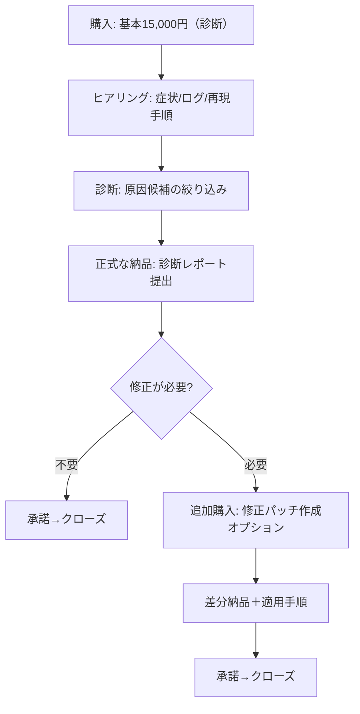

# ココナラでNext.js/Stripe/API連携の不具合診断・修正を出品するための有料オプション設計

## エグゼクティブサマリ

### 事実（公式・実例）
日本のentity["company","ココナラ","japanese skill marketplace"]では、有料オプションは「基本サービスに追加する任意メニュー」として提供でき、制作・ビジネス系カテゴリ等では **最大10件まで**設定可能です。citeturn10search11 有料オプションの**購入を必須にする（＝基本価格だけではサービス提供が成立しない構成）**は公式に禁止されています。citeturn10search4turn10search6  
また、購入後（トークルーム開始後）に有料オプションを追加購入できる導線があり、段階的に「診断→必要なら追加購入」という設計が可能です。citeturn0search1turn10search8

一方で、やり取りは原則サイト内に限定され、外部で直接連絡可能な手段や、外部誘導につながる共有が禁止されています。とくにデータ共有で **Google Drive / Dropbox / entity["company","GitHub","code hosting company"] などの利用が“使用不可”として明示**されています。citeturn4view0turn4view2 容量超過時は、例外的に「ギガファイル便」の利用が許容される旨も公式に示されています。citeturn2search1

### 推奨（運用提案）
あなたの前提（基本15,000円＝診断のみ、テキスト対応、秘密値受領不可、push/本番デプロイ範囲外）を崩さず、CVRと運用安定を両立する最適解は、**有料オプションを3つに絞り**、変動要素を「時間」「実装修正」「優先度」に限定する構成です（後述の“標準型”）。  
選択肢が増えるほど意思決定が鈍り購入率が下がり得ることは、選択肢過多（choice overload）の代表的なフィールド実験でも示されています（24種類提示は立ち止まり率は上がる一方、購入率が大きく下がる）。citeturn9view0turn9view1 よって、**「診断→必要なら後からオプション追加」**の段階設計が最も安全です。citeturn0search1turn2search2turn10search4

## 開発系有料オプションの実例傾向

### 事実（ココナラ上の実例 15件の観測）
下表は、ココナラ上の「バグ修正・不具合解消／Webサイト修正／API連携」など開発系サービスから、**有料オプションの粒度・価格帯・説明文の傾向が読み取れる例**を抽出したものです（10〜20件要件に対し15件）。価格や文言は各ページの掲載内容に基づきます。citeturn1search0turn1search1turn1search2turn1search3turn1search4turn1search12turn1search16turn5search5turn5search7turn5search8turn5search9turn5search12turn5search16turn1search7turn1search11

| 観測元（サービス例） | 粒度（売り方） | 価格帯（例） | 説明文の書き方（誤解防止の工夫） | 根拠 |
|---|---|---:|---|---|
| Next.js不具合・API修正系 | 規模別（軽微/中/大）＋時間目安 | 3,000/7,000/16,000 | 「30〜60分」「1〜2時間〜」のように時間目安を明示 | citeturn1search0 |
| Stripe決済トラブル復旧系 | 機能追加（Webhook連携等）＋設計見直し＋緊急枠 | 5,000〜15,000 | オプション名に“対象”を入れて誤解を減らす（Webhook/サブスク/Woo等） | citeturn1search1 |
| API→スプレッドシート連携 | 従量（API数追加）＋機能追加 | 1,000〜1,500 | 「1つ追加ごとに」の従量単位が明確 | citeturn1search2 |
| Webサイト修正即日 | 緊急（即日/夜間休日）＋成果物（レポート/説明） | 1,000〜3,000 | “成果物”をオプション化（原因調査レポート、修正箇所の説明） | citeturn1search3 |
| HTML・Next.jsバグ即修正 | 追加修正“点数制”＋軽いUI追加 | 8,000〜15,000 | 「同一画面」「追加修正1点」など境界条件を明記 | citeturn1search4 |
| WordPress表示崩れ/SSL | セット（複数箇所）＋保守（メールサポート） | 2,000〜8,000 | 納品後サポート日数を明記（7日等） | citeturn1search7 |
| ちょっとしたWEB修正 | “追加の作業(1)(2)…“の段階課金 | 500〜6,000 | 「1回の購入につき1箇所」など基本スコープが明確 | citeturn1search11 |
| Next.jsコンサル | 診断メニューを細分化（性能/設計/セキュリティ等） | 500〜6,000 | “提案書”“チェックリスト納品”など納品物で区切る | citeturn1search12 |
| Next.js/SEO制作系 | 「価格調整用」オプションを複数 | 500〜30,000 | スコープが案件ごとに変わる前提の“調整枠”運用 | citeturn1search16 |
| Access不具合/VBA | 規模別＋緊急＋見積型 | 3,000〜5,000 | 「2時間以上」「当日〜翌日」など条件を短く提示 | citeturn5search5 |
| AI×API構築 | 機能ブロック追加（API/通知/帳票） | 5,000〜20,000 | “外部API（1つ）追加”の単位が明確 | citeturn5search7 |
| WP機能追加・修正 | 軽/中大＋緊急＋他社連携＋形式変更 | 3,000〜10,000 | 「見積で判定」「可否判断」などで境界を逃がす | citeturn5search8 |
| Shopify CSS/JS修正 | 追加修正＋特急＋原因レポート＋調整用 | 1,000〜10,000 | “原因調査レポート（簡易）”など成果物の段階化 | citeturn5search9 |
| WordPress運用トラブル | 特急のみ（即日〜翌日） | 5,000 | 緊急枠は1本に絞って分かりやすい | citeturn5search12 |
| WEBなんでも修正 | 단位課金（差し替え1箇所）＋機能タグ設置 | 2,000〜12,000 | “1箇所”“タグ設置（除外条件あり）”で誤解防止 | citeturn5search16 |

上の観測から、開発系の有料オプションは大きく次に収束しています（頻出順の傾向、※上表サンプル内での観測）。  
- **緊急系**：即日、24時間以内着手、夜間休日など（3,000〜10,000が多い）citeturn1search3turn1search1turn5search12turn5search9turn5search8  
- **規模別/時間別**：軽微・中規模・大規模、または「追加30分」等（段階課金）citeturn1search0turn5search5turn1search11  
- **数量別（従量）**：API数追加、修正1点追加など（単位が明確）citeturn1search2turn1search4  
- **成果物別**：原因調査レポート、修正箇所の説明、提案書、チェックリスト納品citeturn1search3turn1search12turn5search9  
- **調整用（見積調整）**：スコープ変動が大きい領域で多用citeturn1search16turn5search9  
- **納品後サポート**：7日/1週間といった期限付きciteturn1search7turn1search3

### 推奨（あなたの前提に合わせた読み替え）
あなたのサービスは「診断のみ（15,000円）」が核で、かつ「秘密値受領不可」「push/本番デプロイ不可」という制約が強いです。よって、上記で頻出のうち **“成果物別（レポート）”は基本料金に内包**し、オプションは **(a) 実装（差分納品） (b) 工数延長 (c) 優先度** の3変数に絞るのが、購入者の理解コストとあなたの工数ブレを最小化します（後段で完成文を提示）。

## ルール・仕様面での制約整理

### 事実（公式情報：有料オプションの仕様）
- 有料オプションは「基本サービスに追加できる任意メニュー」で、事後のおひねりと違い**事前決済**にできる旨が説明されています。citeturn0search10  
- 制作・ビジネス系カテゴリ等では、有料オプションは**最大10件まで**設定可能で、価格帯・刻み幅が公式に定義されています（例：500〜10,000は500円単位、10,000〜50,000は1,000円単位など）。citeturn10search11  
- 購入後に追加で有料オプションを購入する導線があり、トークルーム下部から選択して追加購入できます。citeturn0search1turn0search6  
- 取引上の注意として、**オプション購入を必須にするよう促す行為は禁止**され、違反時に取り下げ等があり得ると明記されています。citeturn10search6turn10search4  
- 「サービス購入と同時に購入した有料オプション」は**返金/減額の機能がない**と明記されています（＝購入前のスコープ確定が重要）。citeturn2search2

### 事実（公式情報：正式納品後の扱い）
- 取引をクローズするには、出品者が「正式な納品」を送信する必要があります。citeturn0search2turn0search8  
- 正式な納品後、購入者は「承諾」または「差し戻し」を選択します。差し戻し後は納品前状態に戻り、**2回目の正式納品後は差し戻し/承諾ボタンが表示されない**旨が記載されています。citeturn0search12  
- トークルームのクローズについて、購入ガイドでは「承諾を選択し24時間後、または2回目の正式な納品受領3日後に自動クローズ」等が案内されています。citeturn2search14

### 事実（公式情報：禁止表現・規約違反になりやすい事項）
- 外部でのやり取りや外部取引誘導（連絡先・決済手段の提示等）は禁止され、違反時にアカウント停止等の可能性が明記されています。citeturn4view0turn0search9  
- データ共有として、Google Drive / OneDrive / Dropbox / GitHub 等は「連絡可能な手段が掲載されるおそれのあるサイト」として **使用不可**が明記されています。citeturn4view0turn4view2  
- 一方、添付上限を超える場合は例外的に「ギガファイル便」の利用が許容される旨が公式に示されています（ただし外部サービス上のトラブルはサポート範囲外）。citeturn2search1  
- 表示・表現の面では、ココナラ運営記事で景品表示法の観点から「優良誤認」「有利誤認」等の注意点（効果の断定、根拠のない実績、最上級表現、根拠のない比較など）が整理されています。citeturn10search0turn0search5

### 推奨（あなたのサービスで“事故りやすい”ポイントの回避）
- **「修正完了保証」「必ず直します」系の断定は避ける**：運営記事が示す“効果の断定/誇大”リスクと衝突しやすいです。citeturn10search0turn0search5  
- **有料オプションは“追加購入前提”で案内**：同時購入オプションの返金/減額ができないため、購入者保護の観点でも「まず診断→必要なら追加購入」が揉めにくいです。citeturn2search2turn0search1  
- **提出物（ソース/ログ）は“ココナラ添付 or ギガファイル便”に限定**し、Google DriveやGitHub共有は明確にNGと書きます。citeturn4view0turn2search1

## 購入者心理とCVR観点でのオプション設計

### 事実（根拠あり）
- 選択肢が多いほど購入者の意思決定が難しくなり、購入率が低下し得ることは、選択肢過多（choice overload）の代表的研究で示されています。具体的に、Iyengar & Lepper (2000) のフィールド実験（ジャム試食）では、24種類提示の方が立ち止まり率は高い一方、購入率は **6種類提示の方が大きく高い（約30% vs 3%）**と報告されています。citeturn9view0turn9view1  
- ココナラ公式の出品ノウハウでは、購入者は「提供内容と価格を照らし合わせ、買う理由が明確な時に検討する」旨が述べられ、また「購入にあたってのお願い」を埋めないと認識齟齬が発生しキャンセル/トラブルに繋がり得る、と注意喚起されています。citeturn10search1turn10search4  
- 購入後にトークルームで有料オプションを追加購入できるため、「まず基本サービスを購入→状況が見えたら追加」が機能仕様として可能です。citeturn0search1turn10search8

### 推奨（CVRを落とさない“初実績期”の構成）
- **オプション数は3つに固定**：選択肢を増やすほど比較コストが上がるため、初期は「迷わせない」が強いです（choice overloadの知見）。citeturn9view0turn9view1  
- **段階設計（診断→追加購入）を前面に出す**：基本15,000円は“診断レポート納品”として完結させ、修正は必要時のみ追加購入に誘導する方が、購入者の心理的リスク（いきなり大きく払う）を下げやすいです。citeturn0search1turn10search4turn2search2  
- **オプションは「何が増えるか」を1文で言い切る**：開発系では「緊急」「追加作業」「レポート」が頻出で、購入者が想像しやすい語彙です。citeturn1search3turn1search11turn5search12

## 利益と運用リスクを守るオプション設計

### 事実（根拠あり：揉めやすい原因）
- 有料オプションは「必須化」が禁止されているため、基本サービス単体で要件を満たす必要があります。citeturn10search4turn10search6  
- 同時購入オプションは返金/減額ができないため、購入者が誤って高額オプションを選ぶと、手続きが面倒になりトラブルを誘発しやすいです。citeturn2search2  
- 外部ツール（Google Drive、GitHub等）による共有は明確に禁止されており、開発案件の「リポジトリ共有」発想がそのままだと規約リスクになります。citeturn4view0turn4view2

### 推奨（工数ブレを防ぐ設計：あなたの前提に最適化）
#### 「1件」の定義テンプレ（スコープ固定）
テキスト対応・秘密値なし・pushなしの前提では、スコープを“作業単位”で固定しないと赤字化します。購入者と合意しやすい「不具合1件」の定義をテンプレ化します。

**不具合1件＝以下をすべて満たすもの（テンプレ）**
- 対象フローが1つ（例：Checkout→Webhook→権限付与、サブスク更新、特定API同期など）
- 原因が同一と見なせる（同じ例外原因/同じ設定誤り/同じ実装箇所）
- 変更範囲が「1エンドポイント or 1Webhookイベント群（最大2種類） or 1バッチ処理」に収まる  
- 変更量の上限を置く（例：**変更300行以内 / 追加ファイル2つまで / 調査＋実装 合計2時間以内**）

この定義をサービス本文とFAQに明記し、超える場合は「追加調査」または「修正拡張」へ誘導します（価格交渉ではなく“定義の適用”にする）。

#### 追加料金で揉めない条件文テンプレ（コピペ用・短文）
- 「基本料金は“診断レポート納品”まで。修正は必要時のみオプションです」citeturn10search4turn10search6  
- 「同時購入オプションの返金/減額ができないため、修正は“診断後の追加購入”を推奨します」citeturn2search2turn0search1  
- 「秘密値（APIキー/署名シークレット等）は受け取りません。伏せ字・マスクで共有してください」  
- 「成果物は差分ファイル＋適用手順（push/本番反映は対象外）」  
- 「ファイル共有はココナラ添付、容量超過時のみギガファイル便（公式許容）」citeturn2search1turn4view0  
- 「Google Drive/Dropbox/GitHub等での共有は規約上不可」citeturn4view0turn4view2

#### 取引フロー（段階課金を“仕様に沿って”運用）

この流れは「購入後に有料オプション追加購入が可能」という公式導線に沿っています。citeturn0search1turn10search8

## あなた向け最終提案

ここからは、要求仕様に合わせて **3パターン**提示し、最後に **最終推奨1案**と、画面にコピペできる完成テキストを出します。

### 保守型（CVR優先・初期向け）
#### 推奨（運用提案）
- 基本価格：15,000円（診断のみ）
- オプション（3つ）
  - 追加調査（30分）／3,000円  
    - 説明（60字以内）：ログ追加確認で原因候補を絞り込みます  
  - 修正パッチ作成（軽微1件）／12,000円  
    - 説明（60字以内）：軽微修正を差分で納品（push/デプロイ不可）  
  - 優先対応（購入前相談必須）／5,000円  
    - 説明（60字以内）：対応可なら24時間以内に初回着手します  

**サービス内容に入れる整合文（差し込み用）**  
「基本料金は診断レポート納品まで。修正は必要時のみオプションです（オプション必須化は禁止のため）。」citeturn10search4turn10search6  

**FAQ（要点）**  
- 秘密値は受け取れない／外部共有禁止（Drive/GitHub等）citeturn4view0turn4view2  
- 修正の範囲（軽微の定義）  
- 同時購入オプション返金不可→まず診断推奨citeturn2search2

### 標準型（汎用性と単価の両立）
#### 推奨（運用提案）
- 基本価格：15,000円（診断のみ）
- オプション（3つ）
  - 追加調査（30分）／3,000円  
    - 説明（60字以内）：追加でログ/コードを確認し原因を絞ります  
  - 修正パッチ作成（不具合1件）／20,000円  
    - 説明（60字以内）：修正案を差分で納品（push/本番反映は対象外）  
  - 優先対応（購入前相談必須）／5,000円  
    - 説明（60字以内）：対応可の場合、購入後24時間以内に着手します  

**サービス内容に入れる整合文（差し込み用）**  
「修正は“診断後に必要な場合だけ”追加購入いただく設計です（同時購入オプションは返金/減額不可のため）。」citeturn2search2turn0search1  

**FAQ（要点）**  
- 1件の定義（フロー1つ、原因同一、変更量上限）  
- 共有方法（添付/ギガファイル便のみ）citeturn2search1turn4view0  
- 正式な納品・差し戻しの制約（差し戻しは実質1回）citeturn0search12turn0search2

### 攻め型（高単価・ただし説明負荷も上がる）
#### 推奨（運用提案）
- 基本価格：15,000円（診断のみ）
- オプション（3つ）
  - 修正パッチ作成（複数箇所/最大4時間）／35,000円  
    - 説明（60字以内）：複数箇所をまとめて差分納品（上限あり）  
  - 再発防止セット（ログ/監視/冪等性観点）／15,000円  
    - 説明（60字以内）：再発防止の観点表＋改善優先度を納品します  
  - 緊急対応（夜間・休日）／10,000円  
    - 説明（60字以内）：夜間休日の優先枠（購入前に可否確認）  

※攻め型は、選択肢を3つにしても「内容が重たく見える」ため、初期は標準型の方が安定しやすい（choice overloadの観点でも“理解負荷”が上がる）。citeturn9view0turn9view1

## 最終推奨と完成テキスト

### 推奨（最終判断：標準型）
最終推奨は **標準型**です。理由は次の3点です。

1. **購入者の迷いを増やさず（オプション3つ）CVRを落としにくい**：選択肢過多が購入率を下げ得る実証があるため。citeturn9view0turn9view1  
2. **公式仕様と衝突しにくい**：オプション必須化を避けつつ、購入後の追加購入導線に自然に乗る。citeturn10search4turn0search1turn10search6  
3. **運用リスク（赤字・揉め）を抑える**：同時購入オプション返金不可の制約上、まず診断で合意形成→必要なら追加購入が最も事故りにくい。citeturn2search2turn0search1

---

### ココナラ入力画面にコピペできる完成テキスト（標準型）

```text
【タイトル】
Next.js/Stripe/API連携の不具合を診断します（テキスト）

【キャッチ】
原因が分からない状態から、直し方の道筋まで整理します

【サービス内容】
■このサービスでやること（基本15,000円）
- 症状/ログ/再現手順を元に、原因候補を絞り込み
- 確認ポイント（どこを見るか/何を試すか）を整理
- 修正方針（最小修正案・影響範囲・注意点）を文章で納品
※基本料金は「診断レポート納品」までです。修正は必要時のみオプションです。

■前提（必ずご確認ください）
- テキスト対応のみ
- 秘密値（APIキー/署名シークレット等）は受け取りません（伏せ字/マスクでOK）
- 直接push/本番デプロイは対象外（差分と適用手順を納品します）
- 外部ツール（Google Drive/Dropbox/GitHub等）での共有は不可です
  ファイル共有は「ココナラ添付」、容量超過時のみ「ギガファイル便」を使用します

■ご用意いただきたい情報（秘密値は伏せてOK）
- 何が起きているか（期待/実際、いつから、頻度）
- 直近の変更点（デプロイ/設定変更/ライブラリ更新など）
- エラーログ（該当箇所のみ）
- 再現手順（可能なら最短手順）
- 関連コード（該当箇所のみでOK／丸ごとは要相談）

■対応が難しい/対象外の例
- 秘密値の共有が必須な調査
- 本番環境に直接アクセスしての操作やデプロイ代行
- 仕様未確定の新規開発（別途見積）

【有料オプション（3つ）】
1) 追加調査（30分）／＋3,000円
   追加でログ/コードを確認し原因を絞ります
2) 修正パッチ作成（不具合1件）／＋20,000円
   修正案を差分で納品（push/本番反映は対象外）
3) 優先対応（購入前相談必須）／＋5,000円
   対応可の場合、購入後24時間以内に着手します

【FAQ】
Q. 修正までお願いできますか？
A. 可能です。「修正パッチ作成」オプション購入後に着手します（本番反映はご自身でお願いします）。

Q. 不具合「1件」の定義は？
A. 1つのフローで、原因が同一と見なせるものを1件とします。変更量は2時間/300行以内を目安にします（超える場合は追加調査をご案内）。

Q. 秘密値は渡せませんが大丈夫？
A. はい。秘密値は受け取らず、伏せ字の情報とログ・再現手順で切り分けます。

Q. ソースコードはどこで共有しますか？
A. ココナラ添付を基本に、容量超過時はギガファイル便を使います（外部ストレージやGitHub共有は不可）。

Q. 納品の形式は？
A. 診断レポート（文章）をトークルームに投稿します。修正オプションの場合は差分ファイル＋適用手順を添付します。

Q. 「正式な納品」後のやりとりは？
A. 承諾前に動作確認と質問をお願いします（差し戻しは実質1回の想定です）。
```

## 根拠URL一覧（確認日：2026-02-12 JST）

```text
■有料オプション仕様（最大10件、価格帯・刻み）
https://coconala-support.zendesk.com/hc/ja/articles/218832827-%E6%9C%89%E6%96%99%E3%82%AA%E3%83%97%E3%82%B7%E3%83%A7%E3%83%B3%E3%81%AE%E4%BE%A1%E6%A0%BC%E5%B8%AF%E3%82%84%E5%87%BA%E5%93%81%E4%BE%8B
■有料オプション設定（必須購入の促し禁止 等）
https://coconala-support.zendesk.com/hc/ja/articles/218832807-%E6%9C%89%E6%96%99%E3%82%AA%E3%83%97%E3%82%B7%E3%83%A7%E3%83%B3%E3%81%AE%E8%A8%AD%E5%AE%9A%E3%81%AB%E3%81%A4%E3%81%84%E3%81%A6
■有料オプション購入方法（購入後の追加購入導線）
https://coconala-support.zendesk.com/hc/ja/articles/218832727-%E6%9C%89%E6%96%99%E3%82%AA%E3%83%97%E3%82%B7%E3%83%A7%E3%83%B3%E3%81%AE%E8%B3%BC%E5%85%A5%E6%96%B9%E6%B3%95
■同時購入オプションの返金/減額不可
https://coconala-support.zendesk.com/hc/ja/articles/218289138-%E3%81%8A%E3%81%B2%E3%81%AD%E3%82%8A-%E6%9C%89%E6%96%99%E3%82%AA%E3%83%97%E3%82%B7%E3%83%A7%E3%83%B3-%E4%B8%80%E9%83%A8%E9%87%91%E9%A1%8D%E3%81%AE%E3%82%AD%E3%83%A3%E3%83%B3%E3%82%BB%E3%83%AB%E6%96%B9%E6%B3%95-%E8%B3%BC%E5%85%A5%E8%80%85%E5%90%91%E3%81%91
■サイト外連絡/禁止ツール（GitHub等も含む）
https://coconala-support.zendesk.com/hc/ja/articles/218179168-%E3%82%B5%E3%82%A4%E3%83%88%E5%A4%96%E3%81%A7%E3%81%AE%E9%80%A3%E7%B5%A1%E3%82%84%E5%80%8B%E4%BA%BA%E6%83%85%E5%A0%B1%E3%81%AE%E5%85%B1%E6%9C%89%E3%81%AB%E3%81%A4%E3%81%84%E3%81%A6
■ファイル添付とギガファイル便の許容
https://coconala-support.zendesk.com/hc/ja/articles/218180658-%E3%83%95%E3%82%A1%E3%82%A4%E3%83%AB%E6%B7%BB%E4%BB%98%E6%A9%9F%E8%83%BD%E3%81%AB%E3%81%A4%E3%81%84%E3%81%A6
■正式な納品について
https://coconala-support.zendesk.com/hc/ja/articles/218721047-%E6%AD%A3%E5%BC%8F%E3%81%AA%E7%B4%8D%E5%93%81%E3%81%AB%E3%81%A4%E3%81%84%E3%81%A6
■納品確認（差し戻し/承諾、2回目以降の扱い）
https://coconala-support.zendesk.com/hc/ja/articles/4402957809049-%E7%B4%8D%E5%93%81%E7%A2%BA%E8%AA%8D%E3%81%AB%E3%81%A4%E3%81%84%E3%81%A6-%E8%B3%BC%E5%85%A5%E8%80%85%E5%90%91%E3%81%91
■購入ガイド（クローズの案内等）
https://coconala.com/pages/guide_buy
■出品者向け：サービスページ作成（オプション必須化禁止の明記あり）
https://mag.coconala.com/articles/knowhow-the-basics-of-service-pages
■出品者向け：販売ルール（景表法等の注意）
https://mag.coconala.com/articles/knowhow-rules-about-selling
■choice overload（原典PDF：選択肢が多いと購入率が下がる例）
https://faculty.washington.edu/jdb/345/345%20Articles/Iyengar%20%26%20Lepper%20%282000%29.pdf

■開発系オプション実例（抜粋）
https://coconala.com/services/3951728
https://coconala.com/services/3904812
https://coconala.com/services/3975463
https://coconala.com/services/4018747
https://coconala.com/services/3991090
https://coconala.com/services/3797226
https://coconala.com/services/277462
https://coconala.com/services/3971081
https://coconala.com/services/2668940
https://coconala.com/services/3946842
https://coconala.com/services/3948257
https://coconala.com/services/3807290
https://coconala.com/services/4028121
https://coconala.com/services/4005994
https://coconala.com/services/2106561
```