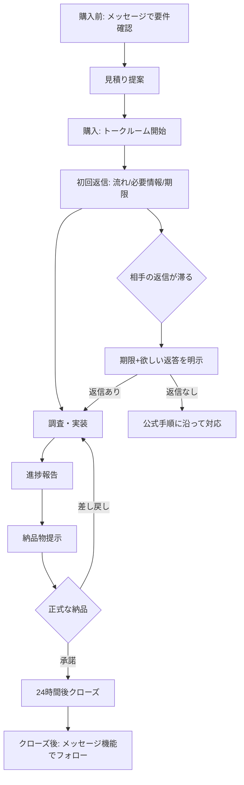

お# ココナラにおけるフリーランスエンジニア向け文章コミュニケーション完全ガイド

## エグゼクティブサマリー

本調査の結論として、ココナラの取引メッセージは「チャットUIだが、評価・決済・トラブル処理が紐づく“準ビジネス文書”」として設計されており、最適な文体は**短いです・ます調＋要点先出し＋次アクション明示**である。根拠として、ココナラ公式テンプレートが「購入直後の挨拶→必要情報要求」「返信が滞った際の確認」「キャンセル時の説明」「正式な納品時の手順説明」を、過度に堅すぎない丁寧文で示している。citeturn23view0turn12view0turn23view1

高評価獲得（★4.8以上）に直結するのは、①**初回返答の速さ**、②**不安を減らす“流れ説明”**、③**状況共有の明確さ**である。ココナラ公式ニュースでは、購入直後の購入者は不安を抱きやすいので「速やかな挨拶」と「流れ説明」が信頼感につながると明言し、初回返答時間が短いほど購入者が安心しやすい指標であるとも述べる。citeturn41view1turn41view2 さらに、サービス購入後に出品者から48時間以内に一度もメッセージがない場合は自動キャンセルとなり、出品者側に★1が自動付与されるため、初動の遅れは評価面でも致命傷になりうる。citeturn24view2

一方で、ココナラの「外部連絡・外部ツール・外部URL共有」には強い制約があり、エンジニア案件でありがちな**GitHub・Google Drive・チャットツール（Slack/Discord等）への誘導は原則禁止**である。したがって、要件ヒアリングやソース共有は「トークルーム＋添付」を前提に設計し直す必要がある。citeturn23view2turn37view0

敬語については、文化審議会答申『敬語の指針』が示す「敬語＝敬意表現の一部であり、形式（語形）だけに過度に注意しない」姿勢が、ココナラのようなテキスト取引にそのまま当てはまる。citeturn52view2 また『公用文作成の考え方（建議）』は、敬語は多用すればよいのではなく、かえってよそよそしくなり得るため、**敬体（です・ます体）ベースで簡潔に**と示している。citeturn34view0

AI下書きを使う運用では、違和感（いわゆるAI臭さ）は「丁寧すぎ」「抽象的」「均質（文の長さ・接続詞・結びが単調）」に集中する。研究系の文脈でも、AI生成文は人間文と異なる統計的特徴（例：困惑度/バースト性、語彙・構文の偏り）で判別が試みられており、文章の均質さは“検出されやすさ”にも関係する。citeturn44view0turn38view0turn39view0 よって本ガイドでは、**AI下書き→人間が「具体化」「削る」「揺らす」**の3工程で仕上げる具体手順とテンプレートを提示する。

---

## ココナラのメッセージ文化の実態調査

ココナラの取引コミュニケーションは、UI上はメッセージでありつつ、**「取引管理」「納品予定日」「正式な納品」「評価」**などの機能が同居している。トークルームは購入後〜完了までのやり取りに用いるべきであり、取引期限は購入から120日、メッセージは原則取り消し不可、入力は最大3,000文字という仕様が示されている。citeturn24view0turn23view1 これらは「雑談チャット」よりも、**証跡と合意形成を残す取引ログ**としての性格が強いことを示唆する。citeturn24view0

image_group{"layout":"carousel","aspect_ratio":"16:9","query":["ココナラ トークルーム 画面","ココナラ 定型文機能 画面","ココナラ トークルーム 納品予定日 設定"]}

### 主流のトーン・文体（チャット寄りかメール寄りか）

公式の投稿文テンプレート（出品者用/購入者用）は、次の特徴を持つ。

- 書き出しは「この度は…ありがとうございます」「どうぞよろしくお願いいたします」など、**メール的な定型挨拶**が基本。citeturn23view0turn12view0  
- ただし長い前置きは少なく、「早速ですが…」「○日までに…可能でしょうか」のように、**短文で要件へ入る**。citeturn23view0turn12view0turn41view2  
- 返信が滞った場合は「確認」「期限」「欲しい返答」を明確にするよう、公式ヘルプが指示している。citeturn23view1  

利用者側の声として、Yahoo!知恵袋では「トークルームをLINEのように連投されると困る」という出品者の相談が見られ、**購入者側が“チャット感覚”で連投するケース**が実在することが示されている。citeturn35view1  
したがって実態は「**文体はメール寄り（敬体＋挨拶）だが、往復テンポはチャット寄り（短文・即応）**」というハイブリッドに落ち着くのが合理的である（公式テンプレとユーザー投稿が示す傾向の統合）。citeturn23view0turn12view0turn35view1

### ★4.8以上の出品者に共通しやすい文章特徴（レビューからの観測）

高評価サービスのレビュー文（複数サービスのサンプル）では、文章要因として次が反復される。

- 「迅速」「数時間後」「数十分で原因特定」など、**速さの明示** citeturn51view0turn10view2turn10view1  
- 「丁寧にコメント付き」「初心者にも分かりやすい解説」「説明いただけた」など、**理解支援（説明の構造化）** citeturn51view0turn11view1turn10view1  
- 「メッセージ共有が円滑」「相談・確認がスムーズ」など、**やり取りの摩擦の少なさ** citeturn11view0  
- 「安心して質問できた」など、**心理的安全性を作る言い回し** citeturn51view0  

またココナラ公式は、初回返答時間が短いほど信頼されやすく、購入者が参考にする指標としてサービス詳細画面にも表示されると説明する。citeturn41view1turn41view2  
この点からも、文章そのものの美しさ以上に「**速く、分かる形で、次を提示する**」が高評価に直結しやすい。

### 丁寧すぎて不自然に感じられるライン（具体例）

「丁寧」は武器だが、**過度の敬語＝信頼**ではない。文化庁の公用文ガイドは「敬語は丁寧度の高い言葉を多用すればよいものではなく、かえってよそよそしい響きになり得る」と述べる。citeturn34view0  
ココナラ文脈で“不自然”になりやすい境界例を、実務での受け取られ方ベースに具体化すると以下。

- **過剰な儀礼語の多段重ね**  
  例：  
  「誠に恐縮ではございますが、何卒ご高配を賜りますよう伏してお願い申し上げます。」  
  → 取引チャットでは距離が開きすぎ、「定型っぽい」「大げさ」に寄りやすい（公用文ガイドの趣旨）。citeturn34view0  

- **“責任回避”に見える冗長な婉曲**  
  例：  
  「〜させていただければと存じます。」「〜したいと思います。」の連続  
  → 『敬語の指針』でも「させていただく」は条件（許可・恩恵）が絡み、許容度に差が出ると整理されているため、乱用は違和感要因になりやすい。citeturn33view0turn33view1  

- **“丁寧に見えるが、実は圧”になっている**  
  例：評価返信で「星5だと思っていましたが…」  
  → ココナラブログの実例では、第三者（見込み購入者）にも見える場でこの種の一言が不平不満に見えやすく、印象を落とすと論じられている。citeturn43view0  

### 匿名化トークルーム文例の収集と比較（公開テンプレ・公開事例ベース）

注意：ココナラ公式ヘルプは、トークルーム内容の外部公開を取引履行目的外で利用/公開する行為を禁止しており、公開されている“生ログ”は構造的に希少である。citeturn23view2turn37view0  
そのため本表は、(a)公式テンプレ、(b)公式ヘルプの例文、(c)ココナラブログ等で公開された例文・事例を、**固有情報を排し、エンジニア案件向けに最小限の言い換えを行って匿名化**した比較である（原典URLは末尾に提示）。

| 例 | 想定シーン | 文体の型 | フォーマル度（1=チャット/5=メール） | 良い点 | リスク/改善ポイント |
|---|---|---:|---:|---|---|
| A | 購入直後の初回挨拶 | 「感謝→流れ→必要情報」 | 4 | 公式テンプレは“まず挨拶＋必要情報依頼”を明示し、初動の迷子を減らす。citeturn23view0turn41view1 | 要求が多いと圧になるため、最初は“最低限＋理由”が安全。citeturn41view1 |
| B | 購入前問い合わせ | 「依頼内容＋納期確認＋範囲確認」 | 4 | 購入者テンプレが、納期と範囲を購入前に確認するモデルを示す。citeturn12view0turn41view2 | “全部まとめて質問”で長文化しやすいので、箇条書き化が有効（公用文ガイドの明確化方針）。citeturn34view0 |
| C | 返信が滞ったリマインド | 「現状確認＋期限＋欲しい返答」 | 4 | 公式ヘルプが“返信期限と返答してほしい内容を明確に”と指示。citeturn23view1 | 期限だけ書くと威圧的なので、返答の選択肢（例：「問題ない」一言）を添える。citeturn23view1 |
| D | 正式な納品送付 | 「納品→承諾/差し戻し→24hでクローズ」説明 | 5 | 公式テンプレは“承諾/差し戻し/24時間後クローズ”まで手順を書き、誤解を減らす。citeturn23view0 | 未提供/途中で正式納品は絶対NGと明記されているため、条件確認が必須。citeturn23view1turn23view2 |
| E | 返信が遅い相手への“強制クローズ予告” | 「仕組み説明→提案→期限」 | 5 | ブログ事例は、突然のクローズを避け、事前打診と期限提示を推奨している。citeturn13view1turn23view1 | 長文は読まれないリスク。要点→詳細の順に分割送信が安全。citeturn24view0turn34view0 |
| F | 評価コメント返信 | 「感謝＋改善意欲（不満は出さない）」 | 4 | 「星5だと思った」等は第三者に悪印象になり得るという実例。citeturn43view0 | 返信は“見込み客に読まれる前提”で、感情ではなく事実と改善方針だけを書く。citeturn43view0turn41view0 |

出典URL（原典）  
```text
https://coconala.com/smartphone/pages/guide_massage_template_for_seller
https://coconala.com/smartphone/pages/guide_massage_template_for_buyer
https://coconala-support.zendesk.com/hc/ja/articles/218179858-購入者から連絡がない
https://coconala.com/news/965
https://coconala.com/blogs/212813/79966
https://coconala.com/blogs/212813/268429
```

---

## 日本語敬語レベルの最適解

### 敬語レベル設計の前提（研究・公的ガイド）

文化審議会答申『敬語の指針』は、敬語を「尊敬語・謙譲語Ⅰ・謙譲語Ⅱ・丁寧語・美化語」の5種類に整理している。citeturn31view0 また同指針は、敬語を「敬意表現」の一部として位置づけ、相互尊重の精神に基づき場面に配慮して使い分けること、さらに「語形や使い方だけに過度に注意」しないことの重要性を述べる。citeturn52view2  
加えて『公用文作成の考え方（建議）』は、敬体（です・ます体）を基本にしつつ、敬語の過度な多用が“よそよそしさ”や“分かりにくさ”につながり得ると明示する。citeturn34view0

この2点を踏まえると、ココナラのIT案件における最適解は次の通りになる。

- **基本形：です・ます調（丁寧語）＋必要箇所だけ尊敬/謙譲**  
- **目的：礼儀の誇示ではなく、誤解防止と合意形成（=取引の安全）**citeturn24view0turn41view0  
- **リズム：短文中心、ただし「手順」「期限」「選択肢」は明示**citeturn23view1turn23view0  

### カジュアル要素の許容範囲（“ですます”ベースでどこまで崩せるか）

ココナラのトークルームは絵文字表示の制約が示されており（Android端末で絵文字が正しく表示されない場合がある）、記号・絵文字に依存した表現は評価されにくい。citeturn24view0turn41view3  
一方で、ユーザーによってはトークルームをLINEのように運用する例が示唆されているため、テキストのテンポ自体はチャット寄りでも破綻しない。citeturn35view1turn23view0

実務上の「許容範囲」を、誤解と不快感のリスクで整理すると以下が現実的である（公的ガイドの“簡潔さ・違和感回避”の趣旨に整合）。citeturn34view0turn52view2

- **OK寄り**：短い相づち（「承知しました」「了解しました」）、簡易な区切り（「—」や箇条書き）、軽いクッション（「もし可能でしたら」）  
- **グレー**：顔文字/絵文字で感情補填（表示崩れ・幼さのリスク）citeturn24view0turn41view3  
- **NG寄り**：タメ口、過度な略語、詰問調（評価項目に“マナー”が含まれる）citeturn41view0turn41view3  

### 指定表現群の自然/不自然/AI臭い比較分析（理由＋代替）

ここでは、ココナラIT案件でAI下書きが出しがちな定型表現を「自然」「不自然」「AI臭い」の観点で評価し、置換案を提示する。評価理由は、(a)『敬語の指針』の枠組み（過剰敬語・させていただくの条件・二重敬語）と、(b)公用文ガイドの簡潔性に基づく。citeturn33view0turn32view0turn34view0turn52view2

| 表現 | 判定 | なぜそう見えるか | 推奨代替（コピペ可） |
|---|---|---|---|
| 「お世話になっております。」 | 自然（ただし乱発NG） | 取引開始・継続の挨拶として定着。使うなら冒頭1回で十分（過度な儀礼は冗長）。citeturn34view0turn52view2 | 「お世話になっております。○○の件、ご連絡します。」 |
| 「恐れ入りますが、○月○日までにご連絡ください。」 | 自然 | 公式ヘルプでも“期限提示”例として示される。citeturn23view1 | 「恐れ入りますが、○/○（○）までにご返信をお願いします。」 |
| 「ご確認のほどよろしくお願いいたします。」 | 自然（多用はAI臭） | 便利だが、毎回この結びだと機械的になる（公用文ガイドの簡潔性・違和感回避）。citeturn34view0 | 「ご確認いただき、OK/修正点を一言いただけると助かります。」citeturn23view1 |
| 「差し支えなければ〜」 | 自然 | 強い依頼を和らげるクッションとして妥当。citeturn52view2 | 「可能でしたら〜」「問題なければ〜」 |
| 「ご査収ください。」 | 不自然（ココナラでは） | メール文化の語で、チャットUIでは硬く“テンプレ感”が強い。citeturn34view0 | 「添付しましたのでご確認ください。」 |
| 「〜させていただきます。」（連発） | AI臭い/過剰になりやすい | 『敬語の指針』では許可・恩恵など条件が絡み、許容度に差が出る。乱用は“へりくだり過多”に見える。citeturn33view0turn33view1 | 「〜します」「〜いたします」（文脈により） |
| 「〜させていただければと存じます。」 | AI臭い | 二重の婉曲で意思が見えにくい（“責任回避”に読まれ得る）。citeturn34view0turn52view2 | 「〜します」「〜したいです（短く）」 |
| 「念のため申し添えます。」 | 不自然（頻出するとAI臭） | 堅い文書語で、要点が増えるほど読みにくい（公用文ガイド）。citeturn34view0 | 「一点だけ補足です。」 |
| 「一旦クローズさせていただき…」 | 条件付きで自然 | 公式ヘルプも“返信なし時の正式納品/クローズ”に言及。ただし未提供状態で正式納品は絶対NG。citeturn23view1turn23view2 | 「○/○まで返信がない場合、現状で正式な納品に進めます（完了物がある場合のみ）。」citeturn23view1 |
| 「お伺いします。」 | 文脈次第 | 二重敬語になり得るが、習慣として定着している二重敬語の例に含まれる。citeturn32view0 | 迷うなら「伺います」「教えてください」で回避。 |
| 「ご連絡いただけますと幸いです。」 | 自然（連発はAI臭） | 丁寧で角が立ちにくいが、連発は均質化。citeturn34view0 | 「ご返信いただけると助かります。」 |

### 日常的な場面での自然/不自然比較例（5件以上）

以下は「同じ内容を、相手距離に合わせてどう言い換えるか」の具体例である。設計思想は“相互尊重＋場面配慮”であり、敬語の形式より適切さを優先する（『敬語の指針』）。citeturn52view2

1) **確認依頼**  
- 自然（取引）： 「この修正で問題ないか、ご確認いただけますか。」  
- 不自然（過剰）： 「恐れ入りますがご確認賜れますと幸甚に存じます。」

2) **追加質問**  
- 自然： 「一点だけ確認です。再現手順はA→Bで合っていますか？」  
- 不自然： 「一点ご教示賜りますようお願い申し上げます。」

3) **進捗共有**  
- 自然： 「いま原因の切り分け中で、次はログの確認に入ります（本日中に一次報告します）。」citeturn41view1  
- 不自然： 「鋭意調査させていただいております。追ってご連絡申し上げます。」（情報がない）

4) **謝罪**  
- 自然： 「こちらの確認不足でした。修正版を○時までにお送りします。」  
- 不自然： 「誠に申し訳ございませんでした。以後このようなことのないよう善処いたします。」（再発防止も期限も曖昧）

5) **期限設定**  
- 自然： 「恐れ入りますが、○/○までに『OK』か『修正点』を一言ください。」citeturn23view1  
- 不自然： 「至急ご返信ください。」（理由も期限もない）

6) **依頼の断り**  
- 自然： 「恐縮ですが、今回の範囲外（例：新規機能追加）なので、見積りを出し直してよいですか？」citeturn23view0  
- 不自然： 「当該の要件は対象外につきキャンセルさせていただきます。」（唐突）

---

## 場面別文例集

前提：Next.js/Stripe/API連携のバグ修正（15,000〜60,000円）、テキストのみ、AI下書きは人が整えて送信。ココナラの禁止事項により、**外部連絡手段やGitHub等の共有を前提にしない**（必要情報はトークルーム本文または添付で受領）。citeturn37view0turn23view2  
また、初回返答が遅いと不信につながりやすく、指標としても表示されうるため「速い一次返信→必要情報→流れ提示」が基本となる。citeturn41view1turn41view2


（「承諾」後24時間でクローズ等は公式テンプレに基づく）citeturn23view0turn23view1

### 初回返信（購入直後）

| 区分 | 本文（コピペ可） | 想定状況（前提） | 敬語レベル | 想定文字数 | 送信タイミング目安 |
|---|---|---|---|---:|---|
| 良い例 | 〇〇様、この度はご購入ありがとうございます。まず状況を正確に把握したいので、下記をトークルームに貼るか、ファイル添付でください。①発生画面/エラー文（スクショ可）②再現手順③環境（Node/ブラウザ/本番or検証）④関連コード（該当ファイル一式）。いただき次第、**本日中に原因の当たりと修正方針**を一次報告します。よろしくお願いいたします。 | 直購入で不安が強い。まず“何をすればよいか”を示す。citeturn41view1 | ですます＋依頼は丁寧 | 220〜320字 | 可能なら30分〜2時間以内（初回返答重視）。citeturn41view1turn24view2 |
| 普通の例 | ご購入ありがとうございます。状況確認のため、エラー内容と再現手順を教えてください。確認後に対応します。 | 最低限は押さえる | ですます | 80〜140字 | 〜数時間以内 |
| 悪い例（AI臭い例） | この度は格別のご高配を賜り誠にありがとうございます。鋭意対応させていただきたく存じますので、恐れ入りますが諸情報一式をご査収の上ご共有賜れますと幸甚です。追って善処いたします。 | 丁寧語の過剰・抽象で不安が残る（公用文ガイドの指摘に合致）。citeturn34view0turn33view0 | 過剰敬語 | 180〜260字 | 遅いとさらに不信 |

### ヒアリング・質問（調査で不足が見つかった）

| 区分 | 本文（コピペ可） | 想定状況（前提） | 敬語レベル | 想定文字数 | 送信タイミング目安 |
|---|---|---|---|---:|---|
| 良い例 | 追加で2点だけ確認です。①「Checkoutに遷移→3Dセキュア→戻る」までで合っていますか？②本番のみ発生なら、直近のデプロイ日時（○/○頃）を教えてください。ここが分かると切り分けが早まります。 | “なぜ聞くか”を添えて納得感 | ですます＋簡潔 | 160〜220字 | 調査中に判明した時点ですぐ |
| 普通の例 | いくつか確認したいので、再現条件をもう少し教えてください。 | 雑 | ですます | 60〜100字 | 同上 |
| 悪い例（AI臭い例） | お手数をおかけし誠に恐縮ですが、詳細を差し支えない範囲でご教示いただけますと幸いに存じます。 | 何を聞きたいか不明で往復が増える（公式は“欲しい返答を明確に”とする）。citeturn23view1turn34view0 | 過剰敬語 | 120〜180字 | 往復が遅くなる |

### 進捗報告

| 区分 | 本文（コピペ可） | 想定状況（前提） | 敬語レベル | 想定文字数 | 送信タイミング目安 |
|---|---|---|---|---:|---|
| 良い例 | 進捗共有です。原因候補は2つに絞れました（A: webhook署名検証、B: APIのidempotencyキー周り）。次はAを先に検証し、○時までに結論→必要ならBへ移ります。追加情報が必要になったらすぐ連絡します。 | 不安低減（見える化） | ですます | 180〜260字 | 1日1回 or 重要な節目（公式も早い連絡を推奨）。citeturn41view1turn34view0 |
| 普通の例 | 調査中です。分かり次第ご連絡します。 | 情報不足 | ですます | 30〜60字 | 連絡が途絶えると不満になりやすい |
| 悪い例（AI臭い例） | 鋭意調査しております。状況に進展があり次第、改めてご連絡申し上げます。引き続き何卒よろしくお願い申し上げます。 | 文は整うが“中身がない”ため不信になりやすい（公用文ガイドの簡潔性趣旨）。citeturn34view0turn41view1 | 過剰敬語 | 80〜140字 | これが続くと危険 |

### 確認依頼（相手の承認待ち）

| 区分 | 本文（コピペ可） | 想定状況（前提） | 敬語レベル | 想定文字数 | 送信タイミング目安 |
|---|---|---|---|---:|---|
| 良い例 | こちらで修正案Aを適用して良さそうです。進めて問題なければ「OK」と一言ください。もし要件が違う場合は、①期待する挙動②NGな挙動 を1〜2行で教えてください。恐れ入りますが○/○（○）までにお願いします。 | 返答の型を固定（公式推奨）citeturn23view1 | ですます | 200〜280字 | 修正着手前 |
| 普通の例 | 進めてよいか確認お願いします。 | 返答が曖昧に | ですます | 30〜70字 | 同上 |
| 悪い例（AI臭い例） | ご多忙のところ誠に恐縮ですが、可否につきご判断賜れますと幸甚に存じます。 | 返答内容が不明で遅延 | 過剰敬語 | 80〜140字 | 往復増 |

### 納品メッセージ（成果物提示〜正式納品前）

| 区分 | 本文（コピペ可） | 想定状況（前提） | 敬語レベル | 想定文字数 | 送信タイミング目安 |
|---|---|---|---|---:|---|
| 良い例 | 修正対応が完了しました。変更点は①○○の例外処理追加 ②○○のAPI呼び出し条件修正です。添付ファイル（差分/修正版）をご確認ください。修正点があれば遠慮なくお知らせください。問題なければ、このまま「正式な納品」に進めます。 | “変更点の要約→確認→次” | ですます | 180〜260字 | 完了直後 |
| 普通の例 | 対応できました。確認お願いします。 | 足りない | ですます | 20〜40字 | 同上 |
| 悪い例（AI臭い例） | 当該事象につきまして、諸般の事情を総合的に鑑み修正を実施いたしました。ご査収ください。 | 具体がなく不安 | 過剰敬語 | 60〜110字 | 同上 |

### トラブル時（遅延・追加費用・要件逸脱）

| 区分 | 本文（コピペ可） | 想定状況（前提） | 敬語レベル | 想定文字数 | 送信タイミング目安 |
|---|---|---|---|---:|---|
| 良い例 | 共有です：当初想定より影響範囲が広く、現状のままだと○日ほど遅れそうです。理由は①再現条件が本番のみ ②関連箇所が複数 です。対応案はA: 最小修正でまず止血（追加費用なし/本日中）B: 根本対応（追加○円/○日）です。どちらで進めるか、○時までにご希望を教えてください。 | 事実→選択肢→期限 | ですます＋丁寧 | 260〜360字 | 判明した瞬間に即 |
| 普通の例 | 少し難しく時間がかかりそうです。 | 不安を増やす | ですます | 40〜80字 | 遅いほど悪化 |
| 悪い例（AI臭い例） | 誠に申し訳ございません。状況が想定外であり、善処いたしますのでご理解賜りたく存じます。 | 具体がなく炎上しやすい（評価基準にマナー/スムーズさ）。citeturn41view0turn41view3 | 過剰敬語 | 80〜140字 | NG |

### クロージング（正式納品送付）

| 区分 | 本文（コピペ可） | 想定状況（前提） | 敬語レベル | 想定文字数 | 送信タイミング目安 |
|---|---|---|---|---:|---|
| 良い例 | 「正式な納品」をお送りします。納品物をご確認ください。問題なければ「承諾」をお選びいただくと、24時間後にトークルームがクローズします。修正が必要な場合は「差し戻し」を選んで内容をご連絡ください。ありがとうございました。 | 公式テンプレ準拠で誤解防止。citeturn23view0turn23view1 | ですます＋手順明示 | 170〜230字 | 完了時点 |
| 普通の例 | 正式な納品を送ります。確認お願いします。 | 手順不足 | ですます | 40〜80字 | 同上 |
| 悪い例（AI臭い例） | 正式な納品を送付させていただきます。何卒ご査収のほどお願い申し上げます。 | UI操作（承諾/差し戻し）説明がなく迷子になりやすい。citeturn23view0turn41view1 | 過剰敬語 | 60〜110字 | 同上 |

---

## テキストのみ対応の信頼構築術

テキストのみは不利ではあるが、「証拠（ログ・手順・差分）」「合意（期限・選択肢）」「可視化（進捗）」を文章で設計できれば、通話より強い場面もある。ココナラが提示する評価基準でも、コミュニケーションは“スムーズさ”と“マナー”で評価されるため、文章設計はそのまま評価対策になる。citeturn41view0turn41view3

### 通話なしのハンデと補い方（実務設計）

- **ハンデ：不安が増幅しやすい**  
  ココナラ公式は、購入直後の購入者が「この後何をすればよいか」不安を抱きやすいと述べ、出品者が速やかに挨拶し流れを説明することが信頼感につながるとする。citeturn41view1  
  → 対策は「初回返信でやることを3つまでに絞って提示」。

- **ハンデ：既読/未読から感情が動きやすい（推測が増える）**  
  返信がない場合は、期限と“返答してほしい内容”を明確にして状況確認するよう公式ヘルプが指示。citeturn23view1  
  → 対策は「OK/修正点/保留の3択を渡す」。

- **ハンデ：誤送信が取り返しにくい**  
  トークルーム内メッセージは原則取り消し不可のため、送信前確認が必須。citeturn24view0turn24view1  
  → 対策は「送信前チェック（宛先・期限・依頼内容・禁止事項）」をルーチン化。

### レスポンス速度・文章量・構成のベストプラクティス

1) **一次返信は「結論：受けた/見た/いつ返す」だけでも価値がある**  
「回答までに時間をいただく旨を一次返信しておくのもおすすめ」と公式ニュースが述べる。citeturn41view1  
例（10秒で送れる一次返信）：  
「確認しました。本日○時までに、原因の当たりと次の質問をお送りします。」

2) **文章量は“短いほど良い”ではなく、相手の次行動が決まる量が最適**  
公式テンプレやヘルプの例文は、挨拶＋要件＋期限など“行動が決まる情報”を含む。citeturn23view0turn23view1turn12view0

3) **構成は固定化して“読むコスト”を下げる**（テキストのみの最大レバレッジ）  
公用文ガイドは、読み手に伝わる条件として「分かりやすさ」「目的に合った書き方」「簡潔」などを挙げる。citeturn34view0  
推奨フォーマット（毎回同じ順番）：  
- ①要点（結論/現状）  
- ②根拠（ログ/再現/観測）  
- ③次の作業  
- ④相手にしてほしい返答（期限付き）citeturn23view1  

### 実践テクニックとテンプレート（コピペ可）

**進捗5行テンプレ**（“調査中”禁止を回避）  
- 進捗：  
- 分かったこと：  
- 残っている不明点：  
- 次にやること（時間/期限）：  
- 購入者にお願い（返答形式＋期限）：citeturn23view1turn41view1  

**定型文で速度を買う**  
ココナラの定型文機能は、よく使う文例を15件まで登録でき、トークルーム等で呼び出せる。citeturn25view0turn24view0  
→ 初回返信、確認依頼、進捗、納品、リマインド、トラブルの6種を登録しておくと運用が安定する（公式ニュースも定型文活用を推奨）。citeturn41view1turn25view0

---

## ココナラ特有の注意点

### 評価コメントに影響する文章要因（制度としての根拠）

ココナラの評価は、総合評価に加えて「コミュニケーション（スムーズさ・マナー）」が項目として定義されている。citeturn41view0turn41view3 つまり文章は“好き嫌い”ではなく、制度上、評価の中核に組み込まれている。さらに評価コメントは400文字までで、アプリでは絵文字入力不可という制約があるため、感情表現よりも簡潔な事実と感謝が有効になりやすい。citeturn41view3

### トラブルや低評価につながるコミュニケーションパターン（具体）

- **外部誘導・外部ツール共有（GitHub含む）**  
  外部での連絡や、直接やり取り可能なサイト/ツール（Googleドライブ、GitHub等）での共有は禁止と明記されている。citeturn37view0turn23view2  
  → IT案件では「リンクください」が地雷になり得るので、必ず「トークルームに貼付 or 添付」で代替する。

- **未提供/提供途中での一方的クローズ（正式な納品）**  
  返信がない場合の正式納品について、公式ヘルプは「サービス未提供・提供途中（完成物の納品前）では絶対に正式な納品を行わない」と警告している。citeturn23view1turn23view2  
  → “早く終わらせたい”は評価事故の典型要因。

- **初回返信の遅延**  
  サービス購入後48時間以内に出品者から一度もメッセージがない場合、自動キャンセル＋出品者に★1が付く。citeturn24view2  
  → 対策は一次返信だけでも入れる（公式ニュースの推奨）。citeturn41view1

- **“星5だと思った”などの評価返信での不満表明**  
  ココナラブログでは、星4への返信で「星5だと思っていました」が不平不満に見え、さらに見込み購入者にも読まれる言葉だと強く指摘している。citeturn43view0  
  → 低評価対応は「感謝＋改善意欲」だけに寄せる。

### リピート率を上げる文章テク（レビュー傾向＋制度からの推論）

リピートを示唆するレビューや表現として、「またリピートします」「またお願いしたい」が複数サービスで確認でき、そこでは“スピード感”“レスポンスの早さ”“丁寧な説明”がセットで語られやすい。citeturn10view2turn51view0turn36view0  
制度面でも、初回返答時間は購入者が参考にする指標とされ、短いほど信頼されやすいと公式が述べる。citeturn41view1turn41view2  
この2点を統合すると、リピートに効く文章は「相手のコストを下げる文章」であり、具体的には次が効く。

- **終わり際に“再発時の入口”を1行で作る**  
  例：「同様の不具合が再発したら、このトークルームに続けて状況を書いてください（クローズ後はメッセージ機能でOKです）。」  
  クローズ後もメッセージ機能でやり取りできることは公式が説明している。citeturn24view0turn24view1

- **“見える化”のテンプレを毎回使う**（進捗・確認・納品）  
  「メッセージ共有が円滑」「確認がスムーズ」などが高評価レビューに現れている。citeturn11view0turn51view0  

### 出品者が避けるべきNGワード・対応（ココナラ特有）

以下は「言った瞬間アウト/疑義」になりやすい語群（公式の“使用不可”例に沿う）。citeturn37view0turn23view2

- **外部連絡誘導**：「LINEで」「Discordで」「メールください」「Zoomで」  
- **外部共有誘導**：「Googleドライブに置きました」「GitHubに上げました」「URL見てください」  
- **外部決済**：「口座に振込」「PayPayで」  
- **個人情報の不用意要求**：住所・連絡先など（必要不可欠ケース以外）citeturn23view2turn37view0  

代替は一貫して「ココナラ内（トークルーム本文/添付）」である。citeturn37view0turn24view0

---

## AI生成文の不自然さの正体

### AI文が違和感を与える具体原因（研究知見＋実務観測）

AI生成テキストは、人間文と異なる統計的性質を持つことを前提に、検出研究が進んでいる。例えばDetectGPTは、LLM生成文がモデル確率の特定の性質（曲率）に偏りやすいという観察に基づき検出を試みている。citeturn44view0 また、困惑度（perplexity）や“burstiness”といった指標でAI文を特徴づける試みが報告されており、AI文と人間文で指標が異なると述べられている。citeturn39view0turn38view0  
日本語の文脈でも、機械生成文は「文法的に正しく見えても、話題のつながり等から不自然と人が判断できる」タイプの不自然さがあり得ることが、文章合成研究で述べられている。citeturn48view1

これらをココナラの実務に翻訳すると、AI臭さは概ね次の形で現れる。

- **抽象語が多く、案件固有情報が少ない**（例：「鋭意対応」「善処」だけ）  
- **敬語が“条件無視”で連発**（特に「させていただく」）  
  『敬語の指針』は「させていただく」を、許可・恩恵の条件に照らして適否が分かれると整理しているため、無条件連発は違和感要因になりやすい。citeturn33view0turn33view1  
- **結びが毎回同じ（均質）**（「何卒よろしくお願いいたします。」の連続）  
- **“丁寧そうで圧”の混入**（「至らない点があれば…」の過剰防衛、評価返信での不満など）citeturn43view0  

### AI臭さを消す具体テクニック（編集ルールとして運用）

以下は「AI下書き→人間が仕上げる」前提で、再現性が高い。

1) **固有情報を最低3つ入れる**（日時/対象/次アクション）  
　例：「○/○」「Checkout画面」「○時までに一次報告」  
　初回返信で流れを説明すると安心につながるという公式見解と整合。citeturn41view1turn41view2

2) **“させていただく”を削る（0〜1回）**  
　許可・恩恵条件が薄い場面では「します/いたします」に置換（指針の整理に基づく）。citeturn33view0turn33view1

3) **1文の長さを混ぜる（短文→中→短）**  
　公用文ガイドの「簡潔」方針に適合。citeturn34view0

4) **接続詞の固定化を避ける**  
　「なお、また、さらに」を連発しない。代わりに箇条書きを使う（トークルームは最大3,000字で整形できる）。citeturn24view0turn34view0

5) **“してほしい返答”を型で渡す**  
　公式ヘルプが推奨する「返信期限＋返答内容の明確化」をそのままテンプレ化。citeturn23view1turn23view0

### AI臭い定型表現リスト（置換推奨）

- 「鋭意対応させていただきます」→「確認します。○時までに一次報告します。」citeturn41view1  
- 「善処いたします」→「Aを確認し、必要ならBを修正します。」  
- 「ご査収ください」→「添付をご確認ください。」  
- 「幸甚に存じます」→「助かります」「お願いします」  
- 「差し支えなければご教示賜り…」→「可能なら○○を教えてください」  

（“過度の敬語は逆効果”という公用文ガイドと、敬語を形式だけでなく適切さで判断するという指針の趣旨に沿う）citeturn34view0turn52view2

### 修正前後の比較例（複数）

**例1：進捗報告**  
- 修正前（AI臭）：  
  「鋭意調査しております。進展があり次第ご連絡申し上げます。」  
- 修正後（人間調整）：  
  「進捗です。原因候補はA/Bの2つです。まずAを確認し、○時までに結論を共有します。」citeturn41view1  

**例2：確認依頼**  
- 修正前（AI臭）：  
  「恐れ入りますがご確認のほどよろしくお願いいたします。」（毎回これ）  
- 修正後：  
  「問題なければ『OK』と一言ください。修正があれば、修正点だけ箇条書きでお願いします。恐れ入りますが○/○までにお願いします。」citeturn23view1  

**例3：トラブル（遅延）**  
- 修正前（AI臭）：  
  「誠に申し訳ございません。想定外の状況につき善処いたします。」  
- 修正後：  
  「共有です：影響範囲が広く、現状だと○日遅れそうです。対応案A（最小/本日）かB（根本/○日）どちらで進めますか？」  
  （評価項目が“コミュニケーション”であることを踏まえ、事実と選択肢を優先）citeturn41view0turn41view3  

---

## すぐ使えるチェックリスト

- **初回返信（購入直後）**  
  - 30分〜2時間以内に一次返信できたか（一次返信でも可）citeturn41view1turn24view2  
  - 「次に購入者がやること」を3点以内で示したかciteturn41view1turn12view0  
  - 外部ツール/外部URL/GitHub共有を要求していないかciteturn37view0turn23view2  

- **ヒアリング**  
  - 質問は「なぜ必要か」を一言添えたか（摩擦低減）citeturn34view0  
  - 返答形式（OK/修正点など）を指定したかciteturn23view1  

- **進捗**  
  - 「調査中」だけで終わっていないか  
  - 次の報告時刻/期限が書かれているかciteturn41view1  

- **敬語**  
  - ですます調を維持できているか（丁寧だが過度ではない）citeturn34view0turn52view2  
  - 「させていただく」を連発していないか（0〜1回に抑える）citeturn33view0turn33view1  
  - 二重敬語・過剰敬語になっていないかciteturn32view0  

- **ココナラ特有の地雷**  
  - トークルームの内容を外部公開する前提の文になっていないかciteturn23view2  
  - メッセージは取り消し不可前提で、送信前チェックをしたかciteturn24view0turn24view1  
  - 未提供/途中で正式な納品をしていないか（絶対NG）citeturn23view1turn23view2  
  - 正式納品時に「承諾/差し戻し/24時間後クローズ」を説明したかciteturn23view0  

- **AI下書き運用**  
  - 固有情報（日時/対象/次アクション）が3つ以上入っているかciteturn41view1  
  - 文章が均質（同じ結び・同じ接続詞）になっていないかciteturn38view0turn44view0  
  - “丁寧そうで圧”の一言（評価返信の不満など）が混ざっていないかciteturn43view0turn34view0