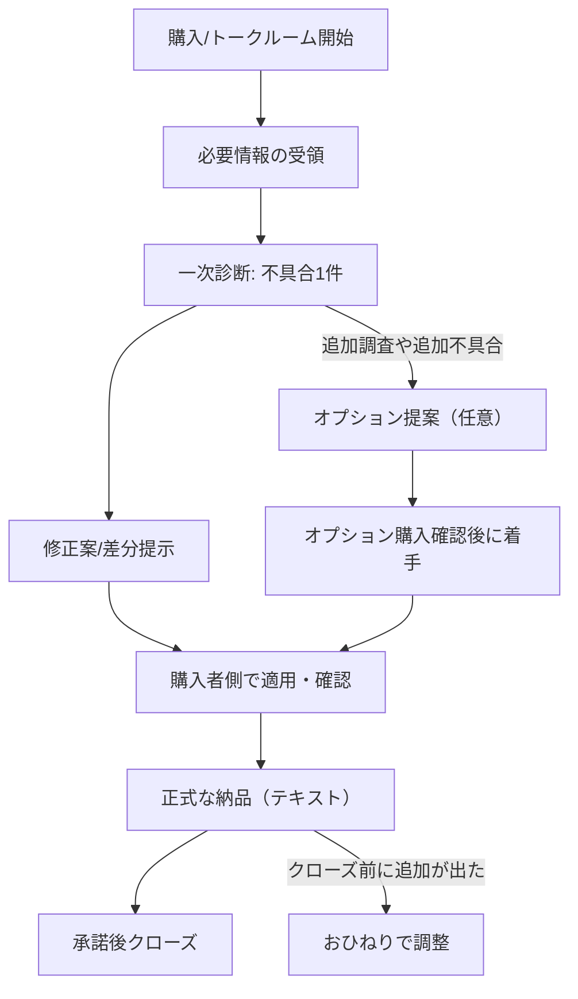

# ココナラ出品を最終確定するための調査レポート Next.js / Stripe / API連携の不具合診断・修正

## エグゼクティブサマリー

**事実（根拠あり）**  
現行案のタイトル／キャッチコピー自体は、ココナラが明示する「景品表示法違反に該当する表現（断定・誇大・根拠のない最上級等）」に該当しやすい語（「絶対」「必ず」「最短」「返金保証」など）を含んでおらず、方向性としては安全寄りです。citeturn3view0  
一方で、ココナラは「**おひねりやオプションの支払いが前提**となっているサービス」や「**返金保証を謳う**」記載を出品不可例として明示しています。したがって本文内で「基本料金は相談費のみ」「制作費（修正）はオプション必須」等に見える書き方は避ける必要があります。citeturn21view1  
また、取引は原則として**ココナラ上で完結**する必要があり、外部ツール（LINE等）でのやり取りや、外部で連絡可能な手段が表示されるおそれのあるサービス（Google Drive 等）での共有・ヒアリングは出品禁止行為の対象になり得ます。citeturn17view0turn19view0turn4view0  

**推奨（提案）**  
最小のズレで「規約適合・CVR・運用安定」を同時に満たすには、**基本料金の提供価値を明確に“完結”させる**（＝基本料金だけでも成果が出る設計）ことが要点です。具体的には、基本料金を「不具合1件」単位で **原因切り分け＋修正案（テキスト差分/手順）まで**含め、追加対応だけを任意の有料オプションにします（オプション必須に見せない）。citeturn17view0turn16view0turn21view1  
CVR面では、ココナラ内の類似出品（Next.js不具合、Stripeトラブル、Stripe導入）を比較すると、価格帯は広いものの「基本料金＋追加オプション（3つ前後）」という構成が一般的で、オプション単価は 3,000円〜15,000円程度が複数見られます。citeturn7view0turn7view3turn7view5turn7view7  
運用安定の観点では、**正式な納品後は有料オプションを購入できない**ため（公式ヘルプ明記）、追加作業が出る可能性がある案件は「正式な納品の前」にオプション確定・決済確認を挟む運用に寄せるのが安全です。citeturn18view0turn14view0  

---

## 調査範囲と前提の確定

**事実（根拠あり）**  
本レポートの根拠は、ユーザー指定どおり **ココナラ公式ヘルプ（Zendesk）／ココナラ公式マガジン（ココナラマグ）／ココナラ内の実例サービスページ**に限定しています。citeturn17view0turn3view0turn7view3turn7view5turn7view7turn7view0  
また、キャッチコピーの文字数目安として、ココナラの出品ガイドは「キャッチコピーを30字以内で作成」と明記しています。citeturn1view0  

**推奨（提案）**  
ユーザー固定方針（対応領域：Next.js/Stripe/API連携、提供形式：テキストのみ、秘密値は受領しない、公開上48時間以内返信）を維持しつつ、ココナラ側の禁止事項（外部誘導・誇大表現・オプション必須化・返金保証）に触れないよう、本文とFAQで「できること／できないこと／追加料金が発生する条件」を先に書き切る構成に寄せるのが最もズレが少ないです。citeturn17view0turn21view1turn3view0turn19view0  

---

## 規約適合と表示ルールの検証

### 誇大・断定・優良誤認／有利誤認の判定

**事実（根拠あり）**  
ココナラ公式ヘルプは、景品表示法違反につながる表現として「効果に関する断定表現や誇大表現（例：絶対〜、必ず〜等）」や「根拠・実績のない最上級表現（例：世界最高、最短、最速等）」などを列挙し、伏字・不確定語を添えても誤認のおそれがあれば規約違反になり得ると明記しています。citeturn3view0  

現行案の  
- タイトル「Next.js/Stripe不具合診断・修正します」  
- キャッチコピー「Webhook・API連携エラーの原因特定から修正まで」  
は、上記ヘルプが例示する「絶対」「必ず」「最短」等を含まず、文言だけで直ちに誇大・断定に該当するリスクは比較的低いです。citeturn3view0  

**推奨（提案）**  
ただし「修正します」が“必ず直る保証”と誤解される余地をゼロにするため、本文に次の安全弁を入れるのが有効です。  
- 「外部要因（決済事業者側の制限・障害等）の場合は回避策／切り分けレポートの納品になる」  
- 「不具合1件＝同一原因に紐づく範囲」  
この補足は誇大回避だけでなく、後段の追加料金判断も明確化します。citeturn3view0turn17view0  

### 有料オプション必須化に見えないか

**事実（根拠あり）**  
ココナラ公式マガジンは「**有料オプションの購入を必須とするサービスの出品は禁止**」と明記しています。citeturn17view0  
さらに公式ヘルプでも「有料オプションを必ず購入するよう促す行為は禁止」とし、禁止行為があった場合に取り下げ等の可能性を示しています。citeturn16view0  
加えて、公式ヘルプ（禁止行為の具体例）では「**おひねりやオプションの支払いが前提となっているサービスは出品できない**」とし、NG例として「基本料金は相談費のみで制作費は含まれない。購入時は制作費用オプションを選択」等を明示しています。citeturn21view1  

**推奨（提案）**  
現行案の「修正実装1件（不具合1件）」を“必須”に見せないために、基本料金側の提供内容を **「不具合1件の原因切り分け＋修正案（テキスト差分/手順）まで含む」** と明記し、オプションは「追加の修正」「追加調査」「優先対応」のみに寄せるのが安全です（後述の完成版ではそう設計）。citeturn17view0turn21view1turn16view0  

### 正式納品後の運用（オプション不可／おひねり可／クローズ後）

**事実（根拠あり）**  
- 公式ヘルプは「**正式な納品後は有料オプションの購入が行えないため、おひねりを利用**」と明記しています。citeturn18view0  
- おひねり（追加支払い）は「トークルームでのやり取りの途中で追加料金を支払える機能」であり、出品者と合意した金額の支払い手段として利用できると説明されています。citeturn18view1  
- おひねりは「出品者が正式な納品をした後でも、**クローズ前まで**の期間であれば支払い可能」と明記されています。citeturn18view1turn10view0  
- トークルームのクローズ条件（承諾後24時間、または一定時間経過等）も公式ヘルプに定義があります。citeturn14view0  

**推奨（提案）**  
運用を安定させる最適解は、（原則として）**正式な納品前に追加作業の要否を確定し、必要な場合はオプション購入を確認してから着手**することです。citeturn16view0turn18view0  
クローズ後に追加が発生した場合、同一トークルーム上での追加決済（オプション／おひねり）ができなくなる可能性が高いため（「クローズ前まで支払い可能」からの整理）、追加対応は新規取引（見積り相談や別サービス購入等）として切り出す運用を推奨します。citeturn18view1turn14view0turn8search11  
※この「クローズ後は支払い手段が閉じる」点は文言上は**明示ではなく構造上の帰結**なので、運用設計としては「クローズ前に全部確定する」を最優先にするのが安全です。citeturn18view1turn14view0  

---

## 実例ページ比較とオプション構成の最適化

### ココナラ内の実例比較

**事実（根拠あり）**  
同一テーマ圏（Next.js不具合／Stripeトラブル／Stripe導入）でココナラ内の実例を抽出すると、基本料金が 3,000円〜23,000円程度まで幅があり、オプションは「軽微〜大規模」「Webhook連携」「急ぎ対応」など粒度・レンジ分けが多いです。citeturn7view0turn7view3turn7view5turn7view7  

| 参照実例（ココナラ内） | 出品タイトル（抜粋） | 表示価格（税抜） | 有料オプション構成（抜粋） | 主な文言・運用上の特徴（抜粋） |
|---|---:|---:|---|---|
| https://coconala.com/services/3951728 | 安くNext.js不具合・API修正対応します | 3,000円 | 軽微+3,000／中規模+7,000／大規模+16,000 | 個人情報マスク依頼、原因不明なら返金等の記載あり（※返金保証は別ヘルプでNG例として明記あり）citeturn7view0turn21view1 |
| https://coconala.com/services/3976957 | Next.js/Reactバグ修正・開発対応します | 10,000円 | （ページ表示上、オプション記載が見当たらない構成） | 「内容により相談」「リポジトリ共有可否」など事前情報の明記。citeturn7view5 |
| https://coconala.com/services/3904812 | Stripe決済トラブル即時復旧します | 20,000円 | Webhook外部連携+10,000／サブスク設計見直し+15,000／急ぎ帯+5,000 等 | 決済ID提示依頼や一時権限など前提条件の明記が強い。citeturn7view3 |
| https://coconala.com/services/1609698 | クレジット決済システム stripeを導入します | 23,000円 | 決済フォーム+15,000／通知メール+18,000／ポータル+30,000 | 「有料オプション」を機能単位で積み上げる構成。citeturn7view7 |

**推奨（提案）**  
初期出品者がCVRと運用安定を両立するには、上の実例の“良い所取り”として次を推奨します。  
- **基本料金は「不具合1件」を完結させる**（原因切り分け＋修正案＋差分提示まで）＝購入者が「まず買ってみる」判断をしやすい。citeturn17view0turn21view1  
- オプションは3つ前後に絞り、**「スコープ増」「時間増」「優先」**の3軸に整理する（購入時に迷わせない）。citeturn17view0turn7view0turn7view3  
- 返金保証・最短・必ず等の強い表現は避け、公式ヘルプがNGとして列挙する地雷を踏まない。citeturn3view0turn21view1  

### 価格レンジの妥当性

**事実（根拠あり）**  
- 有料オプションは「最大10件まで」設定可能で、制作・ビジネス系カテゴリでは 500円〜1,000,000円の範囲で刻み単位が定義されています。citeturn15view3turn12view0  
- 実例では、追加オプションとして 3,000円・7,000円・16,000円（Next.js系）や、5,000円・10,000円・15,000円（Stripeトラブル系）が見られます。citeturn7view0turn7view3  

**推奨（提案）**  
ユーザー提示のオプション案は、実例の分布に概ね沿っています。最終的には以下レンジが「説明しやすく揉めにくい」目安です（※市場相場そのものではなく、ココナラ内実例からの観測レンジ）。citeturn7view0turn7view3turn15view3  
- 追加調査（30分）：**2,000〜5,000円**（提示案 3,000円は中央値寄り）  
- 修正実装（追加1件）：**10,000〜20,000円**（提示案 15,000円はStripe/決済系の重みづけとして妥当）  
- 優先対応：**3,000〜10,000円**（提示案 5,000円は実例と一致）citeturn7view3  

---

## 運用安定のための設計

### 外部誘導・情報共有の取り扱い

**事実（根拠あり）**  
ココナラ公式マガジンは「ココナラ上でやり取りが完結するものだけ」が出品可能で、外部ツールでのやり取りが必要なサービスは出品できないと明記しています。citeturn17view0  
公式ヘルプでも、メールアドレスやSNSアカウント、外部サイトURLの掲載、外部ツールでの提供行為を禁止し、Google Drive 等での共有・ヒアリングを禁止例として明示しています。citeturn19view0  
一方で、トークルーム内にはファイル添付機能があり、トークルームは 200MB まで添付可能、zip も添付可能とされています。citeturn20view0  

**推奨（提案）**  
「秘密値は受領しない」方針は、ココナラの“外部誘導を避ける”ルールとも相性が良いです。実運用では、  
- コードは **該当箇所の抜粋を貼り付け**、または **zip添付（トークルーム添付）**に寄せるciteturn20view0turn17view0  
- 画像・ログは **個人情報や決済情報をマスク**し、ファイルの作成者名などメタ情報にも注意するciteturn20view0  
を本文・お願い欄に明記しておくと、運用ブレが減ります。

### 取引フローを「規約に沿う形」で固定する

**事実（根拠あり）**  
有料オプションは購入時同時購入・取引開始後の追加購入が可能ですが、正式な納品後は購入できず、おひねりの利用が案内されています。citeturn18view0turn18view1  
また、トークルームのクローズ条件が定義されており、クローズ前までおひねり支払いが可能とされています。citeturn14view0turn18view1  

**推奨（提案）**  
「追加対応が発生しやすい」不具合診断・修正は、次のフローで固定するとトラブルが減ります。



この運用は「オプション未払い防止」「オプション強制禁止」「正式納品後はオプション不可」というヘルプ要件と整合します。citeturn16view0turn18view0turn18view1turn14view0  

### 参考スクリーンショット／表示例

**事実（根拠あり）**  
公式ヘルプには、おひねりボタンの表示例（購入者側にのみ表示される旨含む）が掲載されています。citeturn10view0turn18view1  
またココナラの案内ページには、有料オプションが購入画面に反映されるイメージが掲載されています。citeturn12view0  

（画像URL／確認日：2026-02-12）
```text
https://coconala-support.zendesk.com/hc/article_attachments/4404145612569
https://coconala.com/images/pages/about_option/view.png
https://coconala.com/images/pages/about_option/merit_sell.png
https://coconala.com/images/pages/about_option/merit_option.png
```

---

## 「不具合1件」の揉めない定義

**事実（根拠あり）**  
ココナラはオプション機能の使い方として「オプションなし：〇〇まで／オプション：〇〇追加」といった“範囲の明確化”を出品例として示しています。citeturn15view3turn16view0  
また「オプション支払い前提」「価格表記の不一致」などが出品不可例として明示されているため、範囲定義を曖昧にしたまま“後出し追加料金”に見える運用はリスクになります。citeturn21view1turn16view0  

**推奨（提案）**  
開発系の「不具合1件」は、技術的には“1ファイル”や“1行”ではなく“同一原因”で切るほうが揉めにくいです。購入画面に貼れる短文は次を推奨します。

- **短文（購入画面に貼れる）**  
「不具合1件＝同一原因に紐づく1つの現象（1フロー/1エンドポイント）を、原因切り分け→修正差分提示まで対応する範囲です。原因や対象が別の場合は追加1件です。」

---

## 根拠URL一覧

確認日：2026-02-12（Asia/Tokyo）

```text
■公式ヘルプ（coconala-support.zendesk.com）
https://coconala-support.zendesk.com/hc/ja/articles/900004666886
https://coconala-support.zendesk.com/hc/ja/articles/9517522720409
https://coconala-support.zendesk.com/hc/ja/articles/218832807
https://coconala-support.zendesk.com/hc/ja/articles/218832727
https://coconala-support.zendesk.com/hc/ja/articles/218179888
https://coconala-support.zendesk.com/hc/ja/articles/218179938
https://coconala-support.zendesk.com/hc/ja/articles/4403291547417
https://coconala-support.zendesk.com/hc/ja/articles/9517266871193
https://coconala-support.zendesk.com/hc/ja/articles/218180658
https://coconala-support.zendesk.com/hc/ja/articles/218289158
https://coconala-support.zendesk.com/hc/ja/articles/360004600633

■公式マガジン（mag.coconala.com）
https://mag.coconala.com/articles/knowhow-the-basics-of-service-pages

■ココナラ内実例ページ（coconala.com/services）
https://coconala.com/services/3951728
https://coconala.com/services/3976957
https://coconala.com/services/3904812
https://coconala.com/services/1609698

■ココナラ公式ページ（coconala.com）
https://coconala.com/pages/guide_sell
https://coconala.com/pages/guide_market
https://coconala.com/pages/about_option
https://coconala.com/news/1118
```

---

## このままコピペできる最終版

カテゴリ（推奨）  
IT・プログラミング ＞ プログラミング ＞ バグ修正・コード改修代行（※カテゴリ名称は画面上の表示に合わせて選択してください：未確認）

サービスタイトル  
Next.js/Stripe不具合診断・修正します

キャッチコピー  
Webhook・API連携エラーの原因特定から修正まで

サービス内容（1000字以内）  
Next.js（App Router/Pages）＋Stripe（Checkout/Elements/Webhook）や外部API連携で起きる不具合を、原因切り分け→修正案→修正（テキスト差分）まで対応します。  

【基本料金に含まれる範囲（不具合1件）】  
・現象ヒアリング／再現条件の整理  
・ログ／設定／該当コード抜粋の確認（秘密値は受領しません）  
・原因の特定（または候補の絞り込み）と修正方針の提示  
・修正が可能な場合：コピペで適用できる差分（または手順）を提示  
・確認観点チェックリストを納品（再発防止の観点含む）  

【対象例】  
Webhook署名検証エラー／Webhook未着、checkout後のステータス不整合、API Route/Server Actionsの500、環境変数まわり、外部APIの認証・レート制限の切り分け 等  

【進め方】  
購入後に必要情報をご共有→初回返信は通常24時間以内（公開上48時間以内）→内容確定→納品（テキスト）です。  
追加作業が必要な場合のみ、任意の有料オプションをご提案します。

サービス価格  
10,000円

有料オプション3つ（名称60字以内 + 価格）  
1) 追加の修正実装1件（不具合1件）：15,000円  
2) 追加調査（30分）：3,000円  
3) 優先対応（購入前相談必須）：5,000円

購入にあたってのお願い（500字以内）  
ご購入後、以下をトークルームでお知らせください（わかる範囲でOK）。  
1) 期待する挙動と実際の挙動（いつから／頻度）  
2) エラー文・ログ（個人情報はマスク）  
3) Next.js/Nodeのバージョン、実行環境（local/stg/prod）  
4) Stripe関連：モード（test/live）、イベント種別、決済ID（pi_/in_/sub_等）※キー値は不要  
5) 該当コード（貼り付け or zip添付）  

※秘密鍵・Webhookシークレット等の“値”は受領しません（キー名／マスクのみ）。

FAQ（6問・各400字以内）  
Q1. 基本料金でどこまで対応してもらえますか？  
A1. 「不具合1件」について、原因切り分けと修正案（テキスト差分/手順）までが基本料金です。修正には複数ファイルの変更が含まれても、同一原因に紐づく一連の対応であれば1件に含めます。原因が複数ある／別機能まで波及する場合は、追加オプションをご提案します（任意）。  

Q2. 秘密鍵やWebhookシークレットは共有が必要ですか？  
A2. 不要です。秘密値（APIキー、Webhook secret、DBパスワード等）は受領しません。環境変数名・設定箇所・マスクした接頭辞（例：sk_live_****）など、値が漏れない範囲の情報のみで進めます。必要な設定確認は、購入者様側で操作いただく形でご案内します。  

Q3. Stripeのダッシュボード操作が必要な場合はどうしますか？  
A3. 原則、購入者様側で操作いただく前提で、確認箇所と手順を具体的にお伝えします。イベントIDやログ（スクショ/テキスト）があれば、こちらで切り分けできます。作業の性質上、画面共有や外部ツールでのやり取りは行いません。  

Q4. 修正実装は“テキストのみ”で本当に可能ですか？  
A4. 可能です。差分（diff）形式や、置き換え対象ファイルの全文/部分、設定手順をテキストでお送りします。購入者様がそのまま適用できる形を基本にします（適用後の確認方法もセットで提示）。  

Q5. 追加料金が発生するのはどんな時ですか？  
A5. 以下に該当する場合、作業前に金額と範囲を明示して合意後に進めます：①追加調査が必要（想定時間超過）②別の原因/別機能の不具合が見つかった③仕様追加・設計変更が必要④決済事業者側の制約で回避策検討が中心になる、など。  

Q6. 急ぎ（夜間・休日）対応はできますか？  
A6. 可能な範囲で調整します。まずは「いつまでに/何が止まっているか」を購入前にご相談ください。対応枠が確保できる場合のみ、優先対応オプションで着手します（枠が埋まっている場合は未対応となります）。
