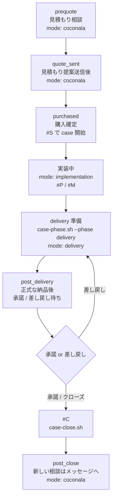

# 運用ガイド（ガチ版）

このファイルは、見積もり相談が来てから、購入、実装、納品、クローズまでを、今の Internal OS の正本だけで1枚にまとめた運用ガイドです。  
迷った時は、このファイルから該当フェーズを開けば「次に何をすればいいか」が分かるようにしています。

前提にしている正本:
- `/home/hr-hm/Project/work/AGENTS.md`
- `/home/hr-hm/Project/work/docs/next-codex-prompt.txt`
- `/home/hr-hm/Project/work/os/core/boot.md`
- `/home/hr-hm/Project/work/os/core/policy.yaml`
- `/home/hr-hm/Project/work/os/core/service-registry.yaml`
- `/home/hr-hm/Project/work/os/coconala/platform-contract.yaml`
- `/home/hr-hm/Project/work/os/coconala/boot.md`
- `/home/hr-hm/Project/work/os/implementation/boot.md`
- `/home/hr-hm/Project/work/os/delivery/boot.md`
- `/home/hr-hm/Project/work/scripts/*.sh`
- `/home/hr-hm/Project/work/.codex/skills/*`

## 0. 最初に見る3つ
迷ったら、まずこの3つを見ます。

1. 今どの mode か  
   `/home/hr-hm/Project/work/runtime/mode.txt`
2. 今どの case が active か  
   `/home/hr-hm/Project/work/runtime/active-case.txt`
3. 外向けに案内してよいサービスは何か  
   `/home/hr-hm/Project/work/os/core/service-registry.yaml`

補足:
- 起動正本は `/home/hr-hm/Project/work/docs/next-codex-prompt.txt`
- OS の整合確認は `/home/hr-hm/Project/work/scripts/os-check.sh`

## 1. 全体フロー図


テキストで見るとこうです。

1. 見積もり相談を受ける  
2. 必要なら見積もり提案を送る  
3. 購入が確定したら `#S` で case を開く  
4. mode を `implementation` にしてコード分析・修正を進める  
5. 納品段階で `case-phase.sh --phase delivery` を実行する  
6. 正式な納品を送り、承諾または差し戻しを受ける  
7. クローズ時に `#C` を実行し、mode を `coconala` に戻す  

## 2. フェーズごとの操作ガイド

### prequote（見積もり相談）
このフェーズで俺がやること:
1. 相手文を貼る
2. 送信用なら `#R`、分析だけなら `#A` を付ける
3. 必要なら `#R` の後ろか次行に補足を書く

このフェーズの mode:
- `/home/hr-hm/Project/work/runtime/mode.txt` は `coconala`

Codex がやること:
- `/home/hr-hm/Project/work/os/coconala/boot.md` を入口にする
- `/home/hr-hm/Project/work/os/coconala/platform-contract.yaml` で「購入前のメッセージ」であることを前提に返す
- `/home/hr-hm/Project/work/.codex/skills/coconala-intake-router-ja/SKILL.md` で入口判定をする
- `/home/hr-hm/Project/work/.codex/skills/coconala-prequote-ops-ja/SKILL.md` で、`15,000円 / 保留 / 断る` を判定する
- 送信用文面を作る時だけ `/home/hr-hm/Project/work/.codex/skills/japanese-chat-natural-ja/SKILL.md` で最終自然化する
- 外向けに案内してよいサービスは `/home/hr-hm/Project/work/os/core/service-registry.yaml` の `public: true` だけを見る

発火するショートカット:
- `#R`
- `#A`
- `#R + 補足`
- `#CL`
- `#GE`

このフェーズで触る主なファイル:
- `/home/hr-hm/Project/work/runtime/replies/latest-source.txt`
- `/home/hr-hm/Project/work/runtime/replies/latest.txt`
- `/home/hr-hm/Project/work/os/core/service-registry.yaml`
- `/home/hr-hm/Project/work/サービスページ/bugfix-15000.live.txt`

具体例:
```text
#R
Stripe のWebhookが本番だけ失敗します。料金も知りたいです。
```

```text
#A
この相談、まず bugfix で返すべきかだけ見て
```

```text
#R
ここは柔らかめにして
```

補足:
- `#R` の補足は optional な `user_override` として扱われる
- 優先順は `hard constraints > user_override > デフォルト推論`
- 補足がなくても今まで通り動く

### quote_sent（見積もり提案を送った後）
このフェーズで俺がやること:
1. 提案送信前後の一言を必要な時だけ作る
2. 未返信が続いた時だけフォローを出す
3. まだ case は開かない

このフェーズの mode:
- まだ `coconala`

Codex がやること:
- 見積もり提案まわりの短文を作る
- 購入前なので、トークルーム前提の書き方にしない
- 送信文を作った時は `/home/hr-hm/Project/work/runtime/replies/latest.txt` に保存する

発火するショートカット:
- `#$1`
- `#$2`
- `#$3`

このフェーズで触る主なファイル:
- `/home/hr-hm/Project/work/docs/coconala-message-templates-short.ja.md`
- `/home/hr-hm/Project/work/.codex/skills/coconala-reply-bugfix-ja/references/ui-progress-tags.ja.md`

具体例:
```text
#$1
```
意味:
- 提案ボタンを押す直前の一言を作る

```text
#$2
```
意味:
- 提案送信後の「確認して、よければ購入へ進んでください」を作る

```text
#$3
```
意味:
- 提案送信後、返信が止まった時の軽いフォローを作る

### purchased（購入後 → 実装開始）
このフェーズで俺がやること:
1. 購入が確定したら case を開く
2. 最初の返信か分析を作る
3. active case を固定する

このフェーズの mode:
- ここから `implementation` に入るのが基本

Codex がやること:
- `#S` の正本 `/home/hr-hm/Project/work/scripts/case-open.sh` を使って case を開く
- `ops/cases/open/{case_id}/README.md` を作る
- `/home/hr-hm/Project/work/runtime/active-case.txt` に case_id を書く
- `/home/hr-hm/Project/work/runtime/mode.txt` を `implementation` にする
- `/home/hr-hm/Project/work/runtime/replies/latest-memory.json` を初期化する

発火するショートカット:
- `#S #R`
- `#S #A`
- `#$0`

このフェーズで触る主なファイル:
- `/home/hr-hm/Project/work/scripts/case-open.sh`
- `/home/hr-hm/Project/work/runtime/active-case.txt`
- `/home/hr-hm/Project/work/runtime/mode.txt`
- `/home/hr-hm/Project/work/ops/cases/open/{case_id}/README.md`

具体例:
```text
#S #R
```
意味:
- case を開始して、そのまま最初の返信も作る

直接スクリプトでやる時の形:
```bash
/home/hr-hm/Project/work/scripts/case-open.sh \
  --service-id bugfix-15000 \
  --route talkroom
```

### 実装中（コード分析・修正）
このフェーズで俺がやること:
1. 相手から来たコード・ログ・再現情報を case に寄せる
2. 重要判断だけ `#M` で残す
3. こちら起点で buyer に送る必要がある時だけ `#P` を使う

このフェーズの mode:
- `implementation`

Codex がやること:
- `/home/hr-hm/Project/work/os/implementation/boot.md` を入口にする
- まず `/home/hr-hm/Project/work/runtime/active-case.txt` と `ops/cases/open/{case_id}/README.md` を読む
- その後、対象コード、ログ、一次証跡を前面に置く
- 返信系 docs は常駐させない
- 返信が必要になった時だけ `Coconala OS Reply Lane` に戻る

発火するショートカット:
- `#P`
- `#R 受領返信`
- `#R 方向性返信`
- `#M`

このフェーズで触る主なファイル:
- `/home/hr-hm/Project/work/ops/cases/open/{case_id}/README.md`
- `/home/hr-hm/Project/work/ops/cases/open/{case_id}/reply-memory.json`
- `/home/hr-hm/Project/work/runtime/replies/latest.txt`
- `/home/hr-hm/Project/work/runtime/replies/latest-source.txt`
- `/home/hr-hm/Project/work/docs/code-comment-style.ja.md`

具体例:
```text
#P
```
意味:
- 購入後トークルームのこちら起点文面を作る（補足がなければデフォルトは途中報告）

```text
#M
decision: 同一原因として継続
reason: Webhook と受信処理の差だけで説明できる
next_action: route.ts と env 差を確認
```
意味:
- 重要判断を `README.md` の `## Mid Snapshots` へ追記する

### delivery（納品準備）
このフェーズで俺がやること:
1. 実装が固まったら delivery へ切り替える
2. 納品物と正式納品文を整える
3. 新しい実装判断は増やさない

このフェーズの mode:
- `delivery`

Codex がやること:
- `/home/hr-hm/Project/work/scripts/case-phase.sh --phase delivery` で phase を切り替える
- `/home/hr-hm/Project/work/os/delivery/boot.md` を入口にする
- `/home/hr-hm/Project/work/.codex/skills/delivery-pack-ja/SKILL.md` で納品物を組む
- bugfix は `00_結論と確認方法.md` とコード納品物を標準にする
- handoff は `00_結論と要点.md` と `01_[対象フロー名]_引き継ぎメモ.md` を標準にする
- トークルームに送る文だけ `japanese-chat-natural-ja` を通す
- 添付する納品物本文には `japanese-chat-natural-ja` を通さない

発火するショートカット:
- `#P 納品前確認`
- `#P 正式納品案内`

このフェーズで触る主なファイル:
- `/home/hr-hm/Project/work/scripts/case-phase.sh`
- `/home/hr-hm/Project/work/ops/cases/open/{case_id}/README.md`
- `/home/hr-hm/Project/work/os/coconala/platform-contract.yaml`
- `/home/hr-hm/Project/work/.codex/skills/delivery-pack-ja/SKILL.md`

直接スクリプトでやる時の形:
```bash
/home/hr-hm/Project/work/scripts/case-phase.sh --phase delivery
```

### post_delivery（正式な納品後）
このフェーズで俺がやること:
1. 正式な納品後の案内を出す
2. 承諾か差し戻しかを待つ
3. 差し戻しが来たら delivery に戻して対応する

このフェーズの mode:
- まだ `delivery`

Codex がやること:
- 正式な納品と通常メッセージを分けて扱う
- 正式な納品後の案内文を作る
- 未返信なら承諾前フォローを作る
- 差し戻しが来たら、差し戻し返信を作る

発火するショートカット:
- `#P 正式納品案内`
- `#P 承諾前フォロー`
- `#R 差し戻し返信`

このフェーズで触る主なファイル:
- `/home/hr-hm/Project/work/os/coconala/platform-contract.yaml`
- `/home/hr-hm/Project/work/runtime/replies/latest.txt`

補足:
- 正式な納品は通常メッセージと別
- 差し戻しは初回の正式な納品に対するものを前提に扱う
- 返金やキャンセルを seller 側で断定しない

### post_close（クローズ後）
このフェーズで俺がやること:
1. クローズ時に `#C` を実行する
2. 次の相談はメッセージで受ける
3. 古いトークルームを継続前提にしない

このフェーズの mode:
- `#C` 実行後に `coconala` へ戻る

Codex がやること:
- `/home/hr-hm/Project/work/scripts/case-close.sh` で open case を閉じる
- case フォルダを `closed` へ移動する
- `/home/hr-hm/Project/work/ops/case-log.csv` を更新する
- `/home/hr-hm/Project/work/runtime/active-case.txt` を空にする
- `/home/hr-hm/Project/work/runtime/mode.txt` を `coconala` に戻す

発火するショートカット:
- `#C`
- `#R クローズお礼`
- `#CL`
- `#GE`

このフェーズで触る主なファイル:
- `/home/hr-hm/Project/work/scripts/case-close.sh`
- `/home/hr-hm/Project/work/ops/cases/closed/{case_id}/README.md`
- `/home/hr-hm/Project/work/ops/case-log.csv`

## 3. ショートカット一覧表
| ショートカット | いつ使うか | 何が起きるか | 正本 | 具体例 |
|---|---|---|---|---|
| `#R` | 送信用返信がほしい時 | 送信用文面を作る。最終自然化も通す。 | `/home/hr-hm/Project/work/docs/next-codex-prompt.txt` / `/home/hr-hm/Project/work/.codex/skills/coconala-prequote-ops-ja/SKILL.md` / `/home/hr-hm/Project/work/.codex/skills/coconala-reply-bugfix-ja/SKILL.md` | `#R` |
| `#A` | 分析だけ見たい時 | 判定メモと次アクションだけ返す。送信用文面は混ぜない。 | `/home/hr-hm/Project/work/docs/next-codex-prompt.txt` / `/home/hr-hm/Project/work/.codex/skills/coconala-prequote-ops-ja/SKILL.md` / `/home/hr-hm/Project/work/.codex/skills/coconala-intake-router-ja/SKILL.md` | `#A\nこの相談、どのサービス向きかだけ見て` |
| `#D` | 下書きを見たい時 | 優先タグとして認識される。補助文書では「下書き」扱い。主スクリプトはない。 | `/home/hr-hm/Project/work/docs/next-codex-prompt.txt` / `/home/hr-hm/Project/work/docs/claude-backup-quickstart.ja.md` | `#D` |
| `#P` | こちら起点で buyer に文面を送りたい時 | 購入後トークルームのこちら起点文面を作る。補足がなければデフォルトは途中報告。 | `/home/hr-hm/Project/work/docs/next-codex-prompt.txt` / `/home/hr-hm/Project/work/docs/coconala-message-templates-short.ja.md` / `/home/hr-hm/Project/work/.codex/skills/coconala-reply-bugfix-ja/references/ui-progress-tags.ja.md` | `#P 途中報告` |
| `#S` | 購入確定後に case を開始する時 | `case-open.sh` で open case 作成、active case 設定、mode 切替を行う。 | `/home/hr-hm/Project/work/scripts/case-open.sh` | `#S #R` |
| `#M` | 重要判断を残したい時 | open case の `README.md` に判断スナップショットを追記する。 | `/home/hr-hm/Project/work/scripts/case-note.sh` | `#M\ndecision: 同一原因\nnext_action: webhook確認` |
| `#C` | クローズ時 | case を closed へ移動し、case log を更新し、mode を `coconala` に戻す。 | `/home/hr-hm/Project/work/scripts/case-close.sh` | `#C` |
| `#CL` | Claude に直近返信を監査させたい時 | `latest-source.txt` と `latest.txt` を対象に、Claude 向け監査プロンプトを作る。 | `/home/hr-hm/Project/work/docs/next-codex-prompt.txt` / `/home/hr-hm/Project/work/.codex/skills/reply-review-prompt-ja/SKILL.md` | `#CL\n温度感だけ厳しめに見て` |
| `#GE` | Gemini に直近返信を監査させたい時 | `latest-source.txt` と `latest.txt` を対象に、Gemini 向け監査プロンプトを作る。 | `/home/hr-hm/Project/work/docs/next-codex-prompt.txt` / `/home/hr-hm/Project/work/.codex/skills/reply-review-prompt-ja/SKILL.md` | `#GE\nscope事故だけ見て` |
| `#R + 補足` | 送信用返信に追加条件を乗せたい時 | 補足を optional な `user_override` として扱う。tone / ask / 返答順へ反映する。 | `/home/hr-hm/Project/work/docs/next-codex-prompt.txt` / `/home/hr-hm/Project/work/.codex/skills/coconala-intake-router-ja/SKILL.md` / `/home/hr-hm/Project/work/.codex/skills/coconala-prequote-ops-ja/SKILL.md` / `/home/hr-hm/Project/work/.codex/skills/coconala-reply-bugfix-ja/SKILL.md` | `#R\nここは柔らかめにして` |
| `#$0` | 直接購入でトークルームが開いた直後 | 購入直後の最初の一通を作る。 | `/home/hr-hm/Project/work/docs/coconala-message-templates-short.ja.md` / `/home/hr-hm/Project/work/.codex/skills/coconala-reply-bugfix-ja/references/ui-progress-tags.ja.md` | `#$0` |
| `#$1` | 提案ボタン送信前 | 提案を送る直前の一言を作る。 | 同上 | `#$1` |
| `#$2` | 提案ボタン送信後 | 購入導線の案内を作る。 | 同上 | `#$2` |
| `#$3` | 提案送信後に未返信 | 見積もり段階の軽いフォローを作る。 | 同上 | `#$3` |

補足:
- `#0$ / #1$ / #2$ / #3$` は `#$0 / #$1 / #$2 / #$3` の誤記エイリアス
- `#S #R` は「case開始 + 送信用返信」
- `#S #A` は「case開始 + 分析のみ」

## 3.5 seller-initiated 文面の扱い
ここで言う seller-initiated 文面とは、buyer から質問が来た時の返答ではなく、**こちらが作業・確認した事実を buyer 向けに伝える文面**です。

例:
- 着手報告
- 途中報告
- 追加情報依頼
- 言い忘れたことの補足
- 実装完了報告
- 納品前確認

考え方:
- buyer の文章に返す時は `#R`
- こちら起点で進捗や確認事項を伝える時は seller-initiated として扱う
- seller-initiated は `#R` の拡張として重く system 化せず、**Codex が今の文脈を buyer 向けに整える軽い運用**で回す

### `#P` の使い方
- `#P` は **こちら起点で buyer に送る文面** の入口として使う
- 補足がなければ、デフォルトは購入後トークルームの途中報告として扱う
- 用途を明示する時は、`#P 途中報告` `#P 補足` `#P 完了報告` `#P 納品前確認` のように目的を足して使う
- `#R` は buyer の文章やアクションに返す時、`#P` はこちらから状況共有・案内・確認を出す時に使う

具体例:
```text
#P 途中報告
```
意味:
- 購入後トークルームで、短い途中報告を作る

### 途中報告以外の seller-initiated 文面
途中報告以外も、`#P` に目的を足して発火させてよい。重い専用タグを増やさず、Codex に目的をそのまま伝える運用でよい。

具体例:
```text
#P 補足
今の実装内容を buyer 向けに短くまとめて
```

```text
#P 納品前確認
```

```text
#P 追加情報依頼
追加で確認したいことを buyer 向けに自然に書いて
```

### seller-initiated 文面で意識すること
- まず buyer に見せてよい事実を出す
- 未確定なことは断定せず、`まだ断定していません` でよい
- 内部語や実装語をそのまま見せすぎない
- 必要なら buyer の次アクションを明示する
- 送信用文面は最終的に `japanese-chat-natural-ja` を通す

### seller-initiated 文面で今やらないこと
- `#R` 本体に seller-initiated の判定を混ぜる
- 完全自動送信にする
- 作業中の内部思考や生ログをそのまま buyer に見せる

## 4. mode の切り替えタイミング
mode は customer の状態名ではなく、Codex がどの OS を前面に置くかの切り替えです。

### mode の正本
- 現在の mode  
  `/home/hr-hm/Project/work/runtime/mode.txt`
- 現在の active case  
  `/home/hr-hm/Project/work/runtime/active-case.txt`

### どう切り替わるか
| タイミング | 何をするか | mode の結果 | 正本 |
|---|---|---|---|
| 見積もり相談中 | そのまま返信・分析する | `coconala` | `/home/hr-hm/Project/work/os/coconala/boot.md` |
| 購入確定 | `#S` または `case-open.sh` | `implementation` | `/home/hr-hm/Project/work/scripts/case-open.sh` |
| 納品準備へ入る | `case-phase.sh --phase delivery` | `delivery` | `/home/hr-hm/Project/work/scripts/case-phase.sh` |
| クローズ | `#C` または `case-close.sh` | `coconala` に戻る | `/home/hr-hm/Project/work/scripts/case-close.sh` |

### active-case.txt と mode.txt の関係
- `active-case.txt` は「今どの案件を前面に置くか」
- `mode.txt` は「今どの OS を前面に置くか」
- `case-open.sh` は両方を書き換える
- `case-switch.sh` も両方を書き換える
- `case-close.sh` は `active-case.txt` を空にし、`mode.txt` を `coconala` に戻す

### よく使う直接コマンド
active case を切り替える:
```bash
/home/hr-hm/Project/work/scripts/case-switch.sh 20260407-01-talkroom
```
または連番だけで切り替える:
```bash
/home/hr-hm/Project/work/scripts/case-switch.sh 1
```

delivery へ切り替える:
```bash
/home/hr-hm/Project/work/scripts/case-phase.sh --phase delivery
```

implementation へ戻す:
```bash
/home/hr-hm/Project/work/scripts/case-phase.sh --phase implementation
```

## 5. ファイル保存先の一覧
| 何の正本か | ファイルパス | いつ使うか |
|---|---|---|
| 起動正本 | `/home/hr-hm/Project/work/docs/next-codex-prompt.txt` | Codex 起動時 |
| 共通ルール | `/home/hr-hm/Project/work/AGENTS.md` | 常時 |
| 現在の mode | `/home/hr-hm/Project/work/runtime/mode.txt` | 迷った時の最初 |
| 現在の active case | `/home/hr-hm/Project/work/runtime/active-case.txt` | 迷った時の最初 |
| 送信用返信 | `/home/hr-hm/Project/work/runtime/replies/latest.txt` | 送信直前確認 / `#CL` / `#GE` |
| 直近の相手文 | `/home/hr-hm/Project/work/runtime/replies/latest-source.txt` | 送信直前確認 / `#CL` / `#GE` |
| 直近の返信メモ | `/home/hr-hm/Project/work/runtime/replies/latest-memory.json` | followup 管理の初期化確認 |
| 進行中 case 一覧 | `/home/hr-hm/Project/work/ops/cases/open/` | 実装・納品中 |
| 進行中 case 記録本体 | `/home/hr-hm/Project/work/ops/cases/open/{case_id}/README.md` | 実装判断 / delivery / close 前 |
| 進行中 case の返信メモ | `/home/hr-hm/Project/work/ops/cases/open/{case_id}/reply-memory.json` | followup 文脈 |
| クローズ済み case 一覧 | `/home/hr-hm/Project/work/ops/cases/closed/` | 過去案件確認 |
| クローズ済み case 記録本体 | `/home/hr-hm/Project/work/ops/cases/closed/{case_id}/README.md` | 参照用 |
| case 一覧ログ | `/home/hr-hm/Project/work/ops/case-log.csv` | クローズ後の一覧 |
| サービス公開状態 | `/home/hr-hm/Project/work/os/core/service-registry.yaml` | 外向け案内前 |
| bugfix の service facts | `/home/hr-hm/Project/work/ops/services/next-stripe-bugfix/service.yaml` | scope / fit 確認 |
| handoff の service facts | `/home/hr-hm/Project/work/ops/services/handoff-25000/service.yaml` | 内部 routing 参考 |
| bugfix の外向け文面正本 | `/home/hr-hm/Project/work/サービスページ/bugfix-15000.live.txt` | 外向け文言確認 |
| handoff の外向け文面正本 | `/home/hr-hm/Project/work/サービスページ/handoff-25000.ready.txt` | 内部準備用 |
| ココナラ共通仕様 | `/home/hr-hm/Project/work/os/coconala/platform-contract.yaml` | 見積もり / 納品 / クローズ前後 |

## 6. 困った時チェックリスト

### 返信が変な時
1. `/home/hr-hm/Project/work/runtime/mode.txt` を見る
2. `coconala` 以外なら、今その返信が本当に必要かを確認する
3. `/home/hr-hm/Project/work/runtime/replies/latest-source.txt` と `latest.txt` を見比べる
4. 送信用にする前に `#A` で分析だけ止める
5. 直近返信を外部監査したい時は `#CL` か `#GE` を使う

### scope 判断に迷った時
1. `/home/hr-hm/Project/work/os/core/service-registry.yaml` で外向けに使えるサービスを確認する
2. bugfix なら `/home/hr-hm/Project/work/ops/services/next-stripe-bugfix/service.yaml` を見る  
   基本単位は `same_cause_and_same_flow_and_same_endpoint`
3. handoff なら `/home/hr-hm/Project/work/ops/services/handoff-25000/service.yaml` を見る  
   基本単位は `one_main_process_flow`
4. 迷ったまま送らず、まず `#A` で分析に止める
5. 購入後なら重要判断を `#M` で `README.md` に残す

### 技術スタック対象外の時
1. `/home/hr-hm/Project/work/os/core/service-registry.yaml` で live を確認する
2. `/home/hr-hm/Project/work/ops/services/next-stripe-bugfix/service.yaml` の in / out scope を確認する
3. 対象外なら、対応していないことを明確に伝える
4. 方向づけを添えるなら、対象スタックに強い人を探す案内までに止める

### 途中キャンセル / 返金の話が出た時
1. seller 側で制度を断定しない
2. `/home/hr-hm/Project/work/os/coconala/platform-contract.yaml` を正本にする
3. まず作業を止めるか、どこまで見ているかを整理する
4. case が進んでいるなら `README.md` に現状を残す
5. 必要なら `#M` で判断メモを残す

### 秘密情報が送られた時
1. 値をこれ以上送らないよう止める
2. 編集できるなら削除、難しければ無効化・再発行を案内する
3. 今後は値そのものではなく、画面やキー名だけで進める
4. `.env` / APIキー / Webhook秘密値の生値は扱わない

## 7. dual-public の注意点
この section は「内部の routing 判断」と「実際に外向けに案内できるか」を分けて見るためのものです。

### まず見る正本
- `/home/hr-hm/Project/work/os/core/service-registry.yaml`

### routing の内部基準
bugfix 側:
- 正本: `/home/hr-hm/Project/work/ops/services/next-stripe-bugfix/service.yaml`
- 基本単位: `same_cause_and_same_flow_and_same_endpoint`
- 主目的: 不具合診断と修正

handoff 側:
- 正本: `/home/hr-hm/Project/work/ops/services/handoff-25000/service.yaml`
- 基本単位: `one_main_process_flow`
- 主目的: 主要1フローの現状整理と引き継ぎメモ

### 今の公開状態
- `bugfix-15000`: `public: true`
- `handoff-25000`: `public: false`

### つまり何に注意するか
1. 内部では `bugfix` と `handoff` の routing 判断をしてよい
2. ただし外向けに案内してよいのは `public: true` のものだけ
3. 現在は `handoff-25000` を外向け返信でサービス名・価格・購入導線つきで出さない
4. `handoff-25000` は内部準備用の参照にとどめる

### routing を迷った時の見方
bugfix が近い時:
- 「今の不具合を直したい」が主目的
- 原因が同一原因 / 同一フロー / 同一エンドポイントに収まりそう

handoff が近い時:
- 「まず中身を理解したい」が主目的
- 主要1フローを整理して、次にどこから触るかを知りたい

境界で迷う時:
- まず内部では bugfix / handoff のどちらが近いかを判定する
- ただし外向け返信では、その時点の `public` を必ず優先する

## 8. 迷った時の最短手順
1. `/home/hr-hm/Project/work/runtime/mode.txt` を見る
2. `/home/hr-hm/Project/work/runtime/active-case.txt` を見る
3. `prequote / quote_sent` ならこのガイドの該当 section と `/home/hr-hm/Project/work/os/coconala/boot.md` を見る
4. `purchased` 以降なら `ops/cases/open/{case_id}/README.md` を開く
5. 外向けサービス案内が絡むなら `/home/hr-hm/Project/work/os/core/service-registry.yaml` を見る

## 9. このガイドの使い方
- 見積もり相談の時は `prequote`
- 提案を送った後は `quote_sent`
- 購入直後は `purchased`
- コードを見ている間は `実装中`
- 納品物を整える時は `delivery`
- 正式な納品を送った後は `post_delivery`
- クローズ後の再相談は `post_close`

この順で開けば、今の Internal OS の正本だけで、その時点の次アクションを追えます。
